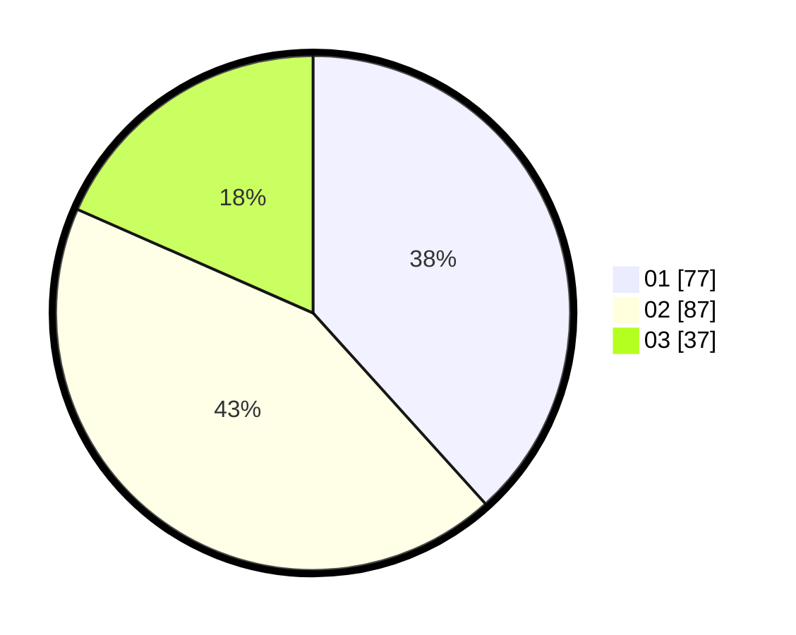

# Hasil

Hasil perolehan suara paslon dapat dilihat pada file paslon-01.txt, paslon-02.txt, dan paslon-03.txt.

Jika tidak ada, artinya data tersebut belum ada pada SIREKAP.

## Perolehan Suara

 * Paslon 01: **77**.
 * Paslon 02: **87**.
 * Paslon 03: **37**.

## Foto C Plano

https://sirekap-obj-formc.kpu.go.id/6930/pemilu/ppwp/31/75/01/10/06/3175011006070-20240214-191710--f934540d-8522-4810-8078-7bdea6c8e701.jpg

https://sirekap-obj-formc.kpu.go.id/6930/pemilu/ppwp/31/75/01/10/06/3175011006070-20240214-191722--cf22943c-f6e5-42e2-972f-60b3b3917dec.jpg

https://sirekap-obj-formc.kpu.go.id/6930/pemilu/ppwp/31/75/01/10/06/3175011006070-20240214-191731--a7d8e7ba-7fe3-49ae-8649-7f6c4c3c04b9.jpg

## DATA PEMILIH TETAP

Jumlah pemilih dalam DPT: **257**.
 * L: **124**.
 * P: **133**.

## DATA PENGGUNA HAK PILIH

Jumlah pengguna hak pilih dalam DPT: **201**.
 * L: **92**.
 * P: **109**.

Jumlah pengguna hak pilih dalam DPTb: **2**.
 * L: **1**.
 * P: **1**.

Jumlah pengguna hak pilih dalam DPK: **1**.
 * L: **0**.
 * P: **1**.

Jumlah pengguna hak pilih: **204**.
 * L: **93**.
 * P: **111**.

## JUMLAH SUARA SAH DAN TIDAK SAH

JUMLAH SELURUH SUARA SAH: **201**.

JUMLAH SUARA TIDAK SAH: **3**.

JUMLAH SELURUH SUARA SAH DAN SUARA TIDAK SAH: **204**.
