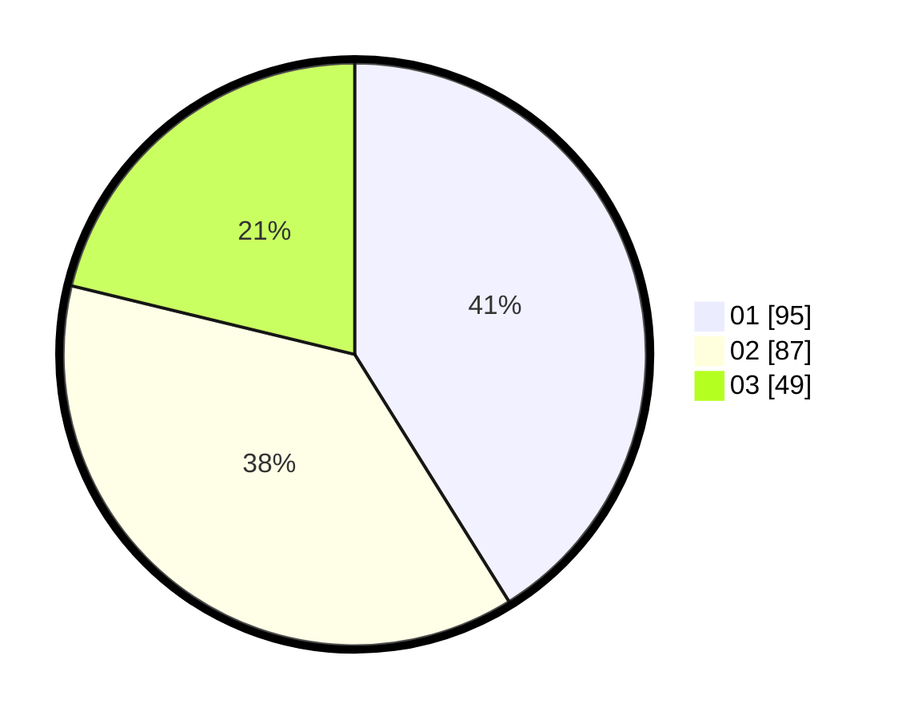

# Hasil

Hasil perolehan suara paslon dapat dilihat pada file paslon-01.txt, paslon-02.txt, dan paslon-03.txt.

Jika tidak ada, artinya data tersebut belum ada pada SIREKAP.

## Perolehan Suara

 * Paslon 01: **95**.
 * Paslon 02: **87**.
 * Paslon 03: **49**.

## Foto C Plano

https://sirekap-obj-formc.kpu.go.id/b3d4/pemilu/ppwp/31/75/01/10/06/3175011006074-20240214-194714--06644511-13e5-4b01-9170-cdf00c510615.jpg

https://sirekap-obj-formc.kpu.go.id/b3d4/pemilu/ppwp/31/75/01/10/06/3175011006074-20240214-190806--7b26b8c8-52ff-42df-8469-7bc8f00e9077.jpg

https://sirekap-obj-formc.kpu.go.id/b3d4/pemilu/ppwp/31/75/01/10/06/3175011006074-20240214-190810--4900fa39-5033-4ee1-83dc-5abe9abfa01a.jpg

## DATA PEMILIH TETAP

Jumlah pemilih dalam DPT: **270**.
 * L: **124**.
 * P: **146**.

## DATA PENGGUNA HAK PILIH

Jumlah pengguna hak pilih dalam DPT: **229**.
 * L: **99**.
 * P: **130**.

Jumlah pengguna hak pilih dalam DPTb: **0**.
 * L: **0**.
 * P: **0**.

Jumlah pengguna hak pilih dalam DPK: **5**.
 * L: **3**.
 * P: **2**.

Jumlah pengguna hak pilih: **234**.
 * L: **102**.
 * P: **132**.

## JUMLAH SUARA SAH DAN TIDAK SAH

JUMLAH SELURUH SUARA SAH: **231**.

JUMLAH SUARA TIDAK SAH: **3**.

JUMLAH SELURUH SUARA SAH DAN SUARA TIDAK SAH: **234**.
