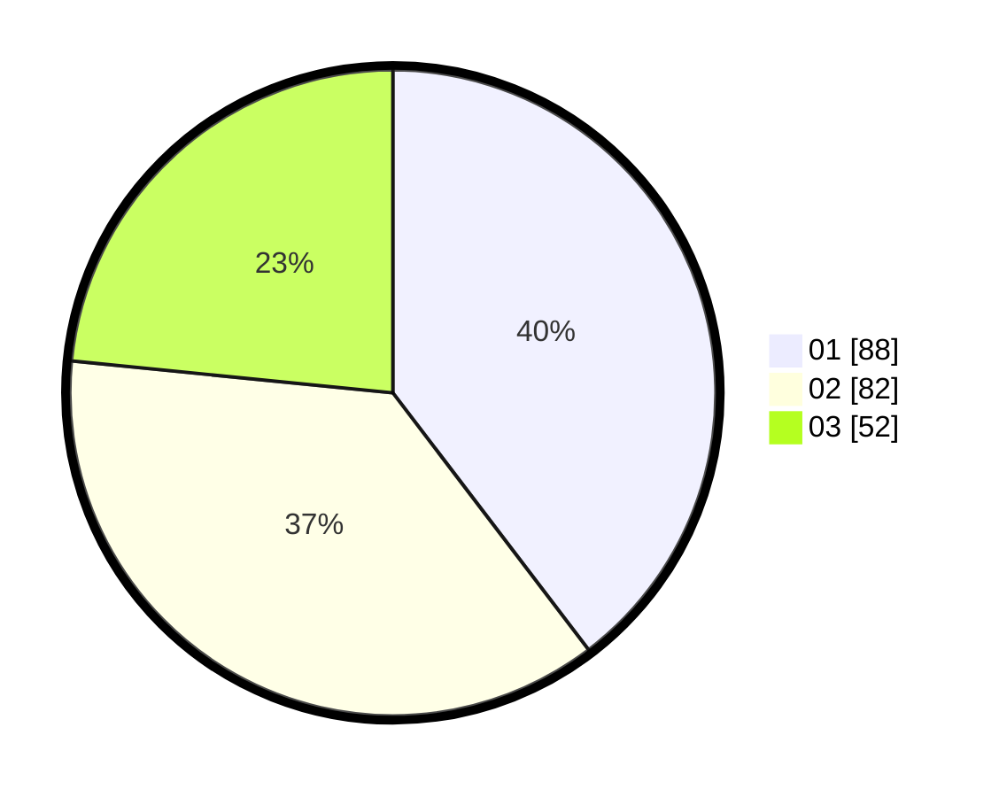

# Hasil

Hasil perolehan suara paslon dapat dilihat pada file paslon-01.txt, paslon-02.txt, dan paslon-03.txt.

Jika tidak ada, artinya data tersebut belum ada pada SIREKAP.

## Perolehan Suara

 * Paslon 01: **88**.
 * Paslon 02: **82**.
 * Paslon 03: **52**.

## Foto C Plano

https://sirekap-obj-formc.kpu.go.id/9a68/pemilu/ppwp/31/75/01/10/06/3175011006077-20240214-215106--bc0fb8f7-951b-498d-85a1-2b106ff91732.jpg

https://sirekap-obj-formc.kpu.go.id/9a68/pemilu/ppwp/31/75/01/10/06/3175011006077-20240214-215656--a791f8b3-deb2-4a2c-bf91-9520f2686743.jpg

https://sirekap-obj-formc.kpu.go.id/9a68/pemilu/ppwp/31/75/01/10/06/3175011006077-20240214-215424--fa3cdb75-96f0-49d6-8552-1a28ec092bbe.jpg
