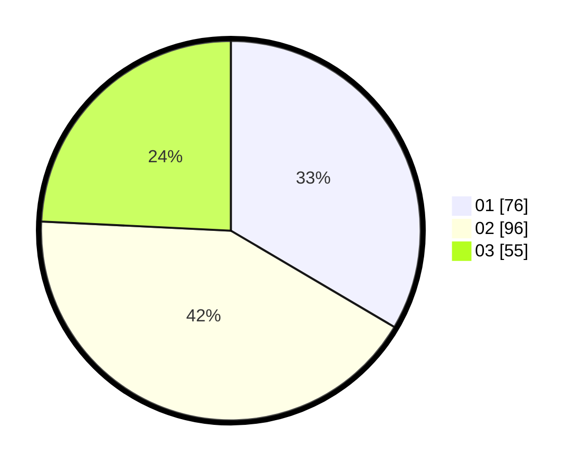

# Hasil

Hasil perolehan suara paslon dapat dilihat pada file paslon-01.txt, paslon-02.txt, dan paslon-03.txt.

Jika tidak ada, artinya data tersebut belum ada pada SIREKAP.

## Perolehan Suara

 * Paslon 01: **76**.
 * Paslon 02: **96**.
 * Paslon 03: **55**.

## Foto C Plano

https://sirekap-obj-formc.kpu.go.id/0123/pemilu/ppwp/31/75/01/10/06/3175011006081-20240215-051544--13e109f6-18c2-4e9a-afcb-56e540f3011b.jpg

https://sirekap-obj-formc.kpu.go.id/0123/pemilu/ppwp/31/75/01/10/06/3175011006081-20240215-051948--a7fd80b1-92ef-4b19-aa00-d22627fffa7d.jpg

https://sirekap-obj-formc.kpu.go.id/0123/pemilu/ppwp/31/75/01/10/06/3175011006081-20240215-052051--e365ee56-e2f0-418f-b384-77067cf413ad.jpg
