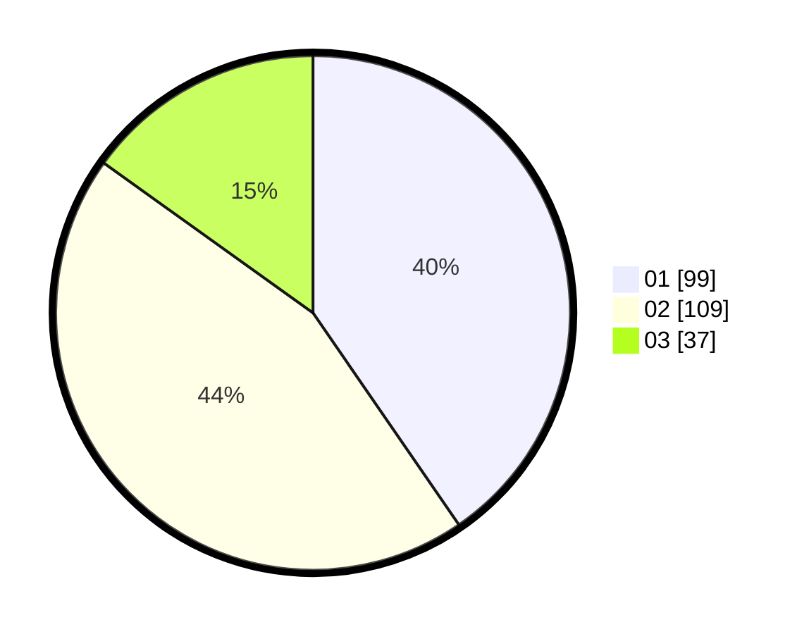

# Hasil

Hasil perolehan suara paslon dapat dilihat pada file paslon-01.txt, paslon-02.txt, dan paslon-03.txt.

Jika tidak ada, artinya data tersebut belum ada pada SIREKAP.

## Perolehan Suara

 * Paslon 01: **99**.
 * Paslon 02: **109**.
 * Paslon 03: **37**.

## Foto C Plano

https://sirekap-obj-formc.kpu.go.id/f19d/pemilu/ppwp/31/75/01/10/06/3175011006083-20240214-202833--c963f604-edfd-41f2-8b14-b6fe4be4a561.jpg

https://sirekap-obj-formc.kpu.go.id/f19d/pemilu/ppwp/31/75/01/10/06/3175011006083-20240214-202922--98964d45-f280-43e2-b14b-8cefba7f4fc5.jpg

https://sirekap-obj-formc.kpu.go.id/f19d/pemilu/ppwp/31/75/01/10/06/3175011006083-20240214-203023--17e9b455-3daf-4e8c-bd89-a4d2e69ef0c8.jpg

## DATA PEMILIH TETAP

Jumlah pemilih dalam DPT: **264**.
 * L: **120**.
 * P: **144**.

## DATA PENGGUNA HAK PILIH

Jumlah pengguna hak pilih dalam DPT: **235**.
 * L: **106**.
 * P: **129**.

Jumlah pengguna hak pilih dalam DPTb: **13**.
 * L: **6**.
 * P: **7**.

Jumlah pengguna hak pilih dalam DPK: **0**.
 * L: **0**.
 * P: **0**.

Jumlah pengguna hak pilih: **248**.
 * L: **112**.
 * P: **136**.

## JUMLAH SUARA SAH DAN TIDAK SAH

JUMLAH SELURUH SUARA SAH: **245**.

JUMLAH SUARA TIDAK SAH: **3**.

JUMLAH SELURUH SUARA SAH DAN SUARA TIDAK SAH: **248**.
