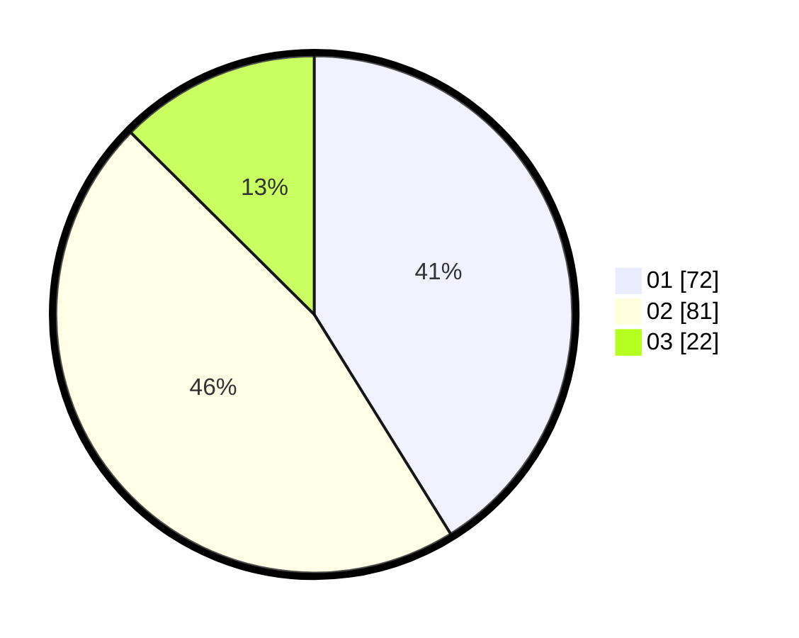

# Hasil

Hasil perolehan suara paslon dapat dilihat pada file paslon-01.txt, paslon-02.txt, dan paslon-03.txt.

Jika tidak ada, artinya data tersebut belum ada pada SIREKAP.

## Perolehan Suara

 * Paslon 01: **72**.
 * Paslon 02: **81**.
 * Paslon 03: **22**.

## Foto C Plano

https://sirekap-obj-formc.kpu.go.id/d184/pemilu/ppwp/31/75/01/10/06/3175011006085-20240214-155242--fb818955-ab8d-4b6c-8ad8-4cc2e8d22bc5.jpg

https://sirekap-obj-formc.kpu.go.id/d184/pemilu/ppwp/31/75/01/10/06/3175011006085-20240214-155246--a1aa0788-7a9b-4519-a41a-0803291f141b.jpg

https://sirekap-obj-formc.kpu.go.id/d184/pemilu/ppwp/31/75/01/10/06/3175011006085-20240214-155250--41ed79ed-8923-4d60-8904-4af8f22f1f65.jpg

## DATA PEMILIH TETAP

Jumlah pemilih dalam DPT: **223**.
 * L: **107**.
 * P: **116**.

## DATA PENGGUNA HAK PILIH

Jumlah pengguna hak pilih dalam DPT: **166**.
 * L: **79**.
 * P: **87**.

Jumlah pengguna hak pilih dalam DPTb: **7**.
 * L: **5**.
 * P: **2**.

Jumlah pengguna hak pilih dalam DPK: **3**.
 * L: **1**.
 * P: **2**.

Jumlah pengguna hak pilih: **176**.
 * L: **85**.
 * P: **91**.

## JUMLAH SUARA SAH DAN TIDAK SAH

JUMLAH SELURUH SUARA SAH: **175**.

JUMLAH SUARA TIDAK SAH: **2**.

JUMLAH SELURUH SUARA SAH DAN SUARA TIDAK SAH: **177**.
