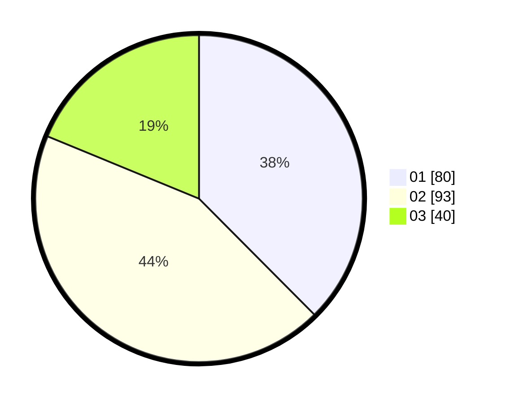

# Hasil

Hasil perolehan suara paslon dapat dilihat pada file paslon-01.txt, paslon-02.txt, dan paslon-03.txt.

Jika tidak ada, artinya data tersebut belum ada pada SIREKAP.

## Perolehan Suara

 * Paslon 01: **80**.
 * Paslon 02: **93**.
 * Paslon 03: **40**.

## Foto C Plano

https://sirekap-obj-formc.kpu.go.id/1e6e/pemilu/ppwp/31/75/01/10/06/3175011006089-20240214-185629--6dbd7ba6-8360-4035-bff0-2b118e6eed52.jpg

https://sirekap-obj-formc.kpu.go.id/1e6e/pemilu/ppwp/31/75/01/10/06/3175011006089-20240214-184738--9f775919-5c98-4429-9e0b-a1723ff25609.jpg

https://sirekap-obj-formc.kpu.go.id/1e6e/pemilu/ppwp/31/75/01/10/06/3175011006089-20240214-190449--5f5b529f-04f1-4e0e-bc2c-7a1b5edd03fb.jpg

## DATA PEMILIH TETAP

Jumlah pemilih dalam DPT: **255**.
 * L: **120**.
 * P: **135**.

## DATA PENGGUNA HAK PILIH

Jumlah pengguna hak pilih dalam DPT: **208**.
 * L: **98**.
 * P: **110**.

Jumlah pengguna hak pilih dalam DPTb: **5**.
 * L: **3**.
 * P: **2**.

Jumlah pengguna hak pilih dalam DPK: **2**.
 * L: **2**.
 * P: **0**.

Jumlah pengguna hak pilih: **215**.
 * L: **103**.
 * P: **112**.

## JUMLAH SUARA SAH DAN TIDAK SAH

JUMLAH SELURUH SUARA SAH: **213**.

JUMLAH SUARA TIDAK SAH: **2**.

JUMLAH SELURUH SUARA SAH DAN SUARA TIDAK SAH: **215**.
