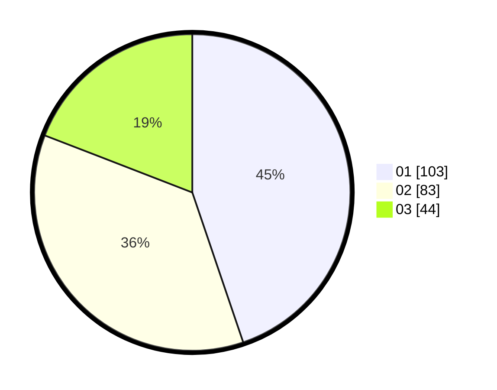

# Hasil

Hasil perolehan suara paslon dapat dilihat pada file paslon-01.txt, paslon-02.txt, dan paslon-03.txt.

Jika tidak ada, artinya data tersebut belum ada pada SIREKAP.

## Perolehan Suara

 * Paslon 01: **103**.
 * Paslon 02: **83**.
 * Paslon 03: **44**.

## Foto C Plano

https://sirekap-obj-formc.kpu.go.id/bf6d/pemilu/ppwp/31/75/01/10/06/3175011006092-20240214-184645--3dc53a30-954d-4f76-a886-378d3eb3999d.jpg

https://sirekap-obj-formc.kpu.go.id/bf6d/pemilu/ppwp/31/75/01/10/06/3175011006092-20240214-184651--2ea2ac73-9d53-4bcf-80f5-ad231ef74304.jpg

https://sirekap-obj-formc.kpu.go.id/bf6d/pemilu/ppwp/31/75/01/10/06/3175011006092-20240214-162241--f4f8d490-4061-4254-8f64-0bb4292cc4f2.jpg

## DATA PEMILIH TETAP

Jumlah pemilih dalam DPT: **262**.
 * L: **130**.
 * P: **132**.

## DATA PENGGUNA HAK PILIH

Jumlah pengguna hak pilih dalam DPT: **216**.
 * L: **115**.
 * P: **101**.

Jumlah pengguna hak pilih dalam DPTb: **9**.
 * L: **4**.
 * P: **5**.

Jumlah pengguna hak pilih dalam DPK: **5**.
 * L: **0**.
 * P: **5**.

Jumlah pengguna hak pilih: **230**.
 * L: **119**.
 * P: **111**.

## JUMLAH SUARA SAH DAN TIDAK SAH

JUMLAH SELURUH SUARA SAH: **230**.

JUMLAH SUARA TIDAK SAH: **0**.

JUMLAH SELURUH SUARA SAH DAN SUARA TIDAK SAH: **230**.
