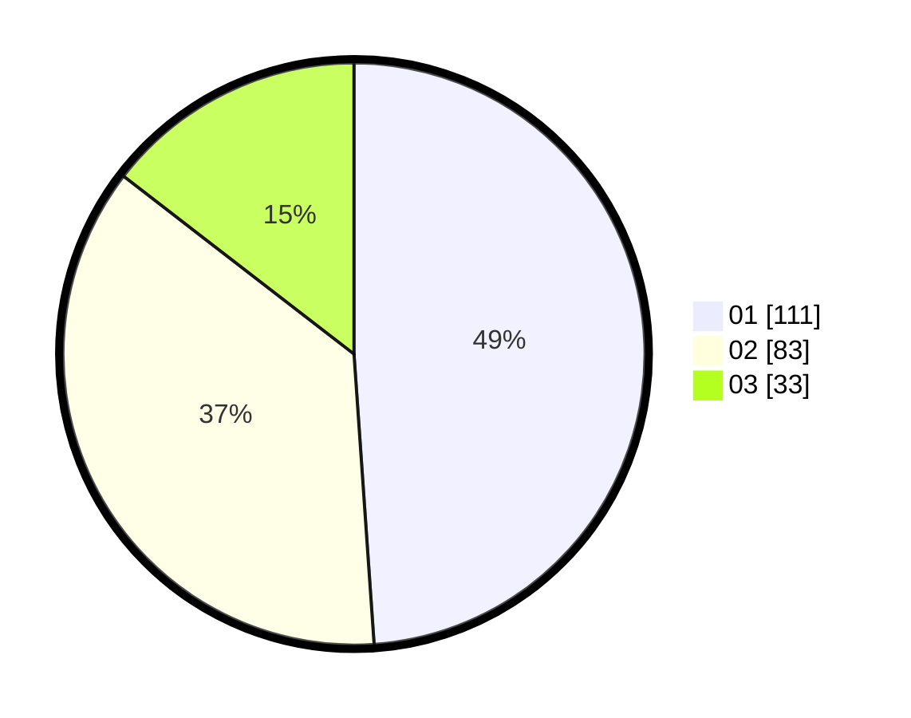

# Hasil

Hasil perolehan suara paslon dapat dilihat pada file paslon-01.txt, paslon-02.txt, dan paslon-03.txt.

Jika tidak ada, artinya data tersebut belum ada pada SIREKAP.

## Perolehan Suara

 * Paslon 01: **111**.
 * Paslon 02: **83**.
 * Paslon 03: **33**.

## Foto C Plano

https://sirekap-obj-formc.kpu.go.id/9fb5/pemilu/ppwp/31/75/01/10/06/3175011006093-20240214-190113--ca2f95c9-fdb3-4d2f-9dac-1e6c5f6ab00b.jpg

https://sirekap-obj-formc.kpu.go.id/9fb5/pemilu/ppwp/31/75/01/10/06/3175011006093-20240214-191552--b27aba98-75e2-458b-a344-9dea01838e6a.jpg

https://sirekap-obj-formc.kpu.go.id/9fb5/pemilu/ppwp/31/75/01/10/06/3175011006093-20240214-190239--3878c130-a204-42fe-8faf-9804c78b7007.jpg

## DATA PEMILIH TETAP

Jumlah pemilih dalam DPT: **254**.
 * L: **115**.
 * P: **139**.

## DATA PENGGUNA HAK PILIH

Jumlah pengguna hak pilih dalam DPT: **224**.
 * L: **96**.
 * P: **128**.

Jumlah pengguna hak pilih dalam DPTb: **4**.
 * L: **1**.
 * P: **3**.

Jumlah pengguna hak pilih dalam DPK: **2**.
 * L: **1**.
 * P: **1**.

Jumlah pengguna hak pilih: **230**.
 * L: **98**.
 * P: **132**.

## JUMLAH SUARA SAH DAN TIDAK SAH

JUMLAH SELURUH SUARA SAH: **227**.

JUMLAH SUARA TIDAK SAH: **3**.

JUMLAH SELURUH SUARA SAH DAN SUARA TIDAK SAH: **230**.
