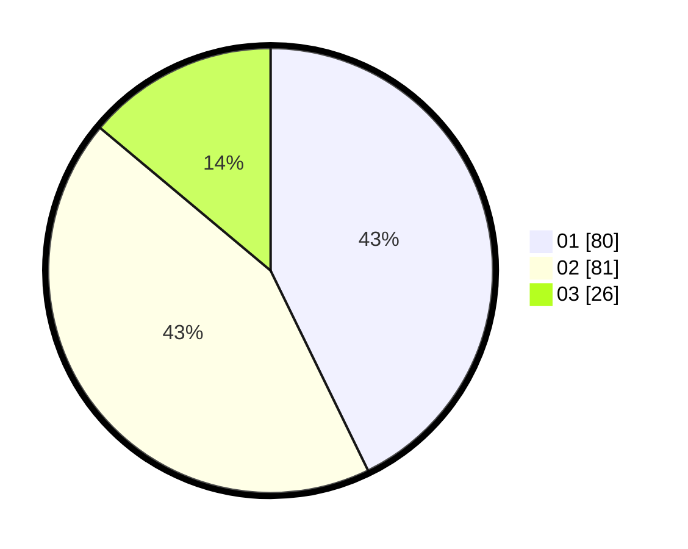

# Hasil

Hasil perolehan suara paslon dapat dilihat pada file paslon-01.txt, paslon-02.txt, dan paslon-03.txt.

Jika tidak ada, artinya data tersebut belum ada pada SIREKAP.

## Perolehan Suara

 * Paslon 01: **80**.
 * Paslon 02: **81**.
 * Paslon 03: **26**.

## Foto C Plano

https://sirekap-obj-formc.kpu.go.id/4e40/pemilu/ppwp/31/75/01/10/06/3175011006095-20240214-195533--d4c7c592-337e-4f06-b70c-8f4d8827db75.jpg

https://sirekap-obj-formc.kpu.go.id/4e40/pemilu/ppwp/31/75/01/10/06/3175011006095-20240214-194145--96585c18-8075-4236-bba3-1a913f72845c.jpg

https://sirekap-obj-formc.kpu.go.id/4e40/pemilu/ppwp/31/75/01/10/06/3175011006095-20240214-195156--6528827b-7236-4df2-bab9-fbf70d66c0bd.jpg
