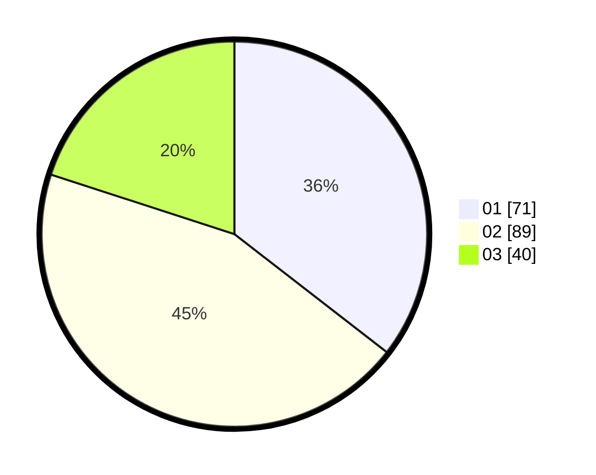

# Hasil

Hasil perolehan suara paslon dapat dilihat pada file paslon-01.txt, paslon-02.txt, dan paslon-03.txt.

Jika tidak ada, artinya data tersebut belum ada pada SIREKAP.

## Perolehan Suara

 * Paslon 01: **71**.
 * Paslon 02: **89**.
 * Paslon 03: **40**.

## Foto C Plano

https://sirekap-obj-formc.kpu.go.id/d61e/pemilu/ppwp/31/75/01/10/06/3175011006098-20240214-230010--084c9a07-e1d8-408b-a55f-21e6a1429650.jpg

https://sirekap-obj-formc.kpu.go.id/d61e/pemilu/ppwp/31/75/01/10/06/3175011006098-20240214-230132--07aae0a4-2237-4711-beac-70230d246055.jpg

https://sirekap-obj-formc.kpu.go.id/d61e/pemilu/ppwp/31/75/01/10/06/3175011006098-20240214-230557--bcf87009-ae79-457e-a322-17bd1ca0fc1e.jpg
