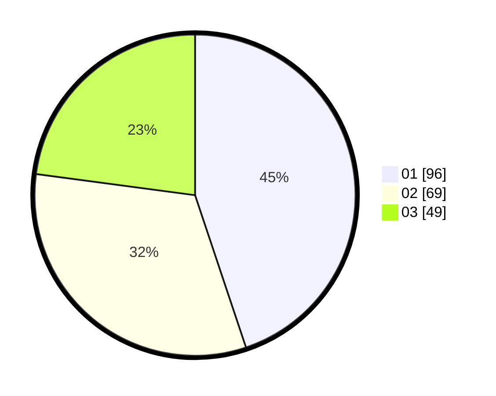

# Hasil

Hasil perolehan suara paslon dapat dilihat pada file paslon-01.txt, paslon-02.txt, dan paslon-03.txt.

Jika tidak ada, artinya data tersebut belum ada pada SIREKAP.

## Perolehan Suara

 * Paslon 01: **96**.
 * Paslon 02: **69**.
 * Paslon 03: **49**.

## Foto C Plano

https://sirekap-obj-formc.kpu.go.id/14cb/pemilu/ppwp/31/75/01/10/06/3175011006100-20240214-203526--61b47d7e-877c-4b23-af8f-7ef77d5f6887.jpg

https://sirekap-obj-formc.kpu.go.id/14cb/pemilu/ppwp/31/75/01/10/06/3175011006100-20240214-231523--5b91a5fe-30ec-4880-be1a-af8c9eb2094a.jpg

https://sirekap-obj-formc.kpu.go.id/14cb/pemilu/ppwp/31/75/01/10/06/3175011006100-20240214-231712--a1436146-468f-42ec-8f9c-af23d86beec8.jpg

## DATA PEMILIH TETAP

Jumlah pemilih dalam DPT: **258**.
 * L: **128**.
 * P: **130**.

## DATA PENGGUNA HAK PILIH

Jumlah pengguna hak pilih dalam DPT: **217**.
 * L: **98**.
 * P: **119**.

Jumlah pengguna hak pilih dalam DPTb: **0**.
 * L: **0**.
 * P: **0**.

Jumlah pengguna hak pilih dalam DPK: **10**.
 * L: **5**.
 * P: **5**.

Jumlah pengguna hak pilih: **227**.
 * L: **103**.
 * P: **124**.

## JUMLAH SUARA SAH DAN TIDAK SAH

JUMLAH SELURUH SUARA SAH: **214**.

JUMLAH SUARA TIDAK SAH: **13**.

JUMLAH SELURUH SUARA SAH DAN SUARA TIDAK SAH: **227**.
