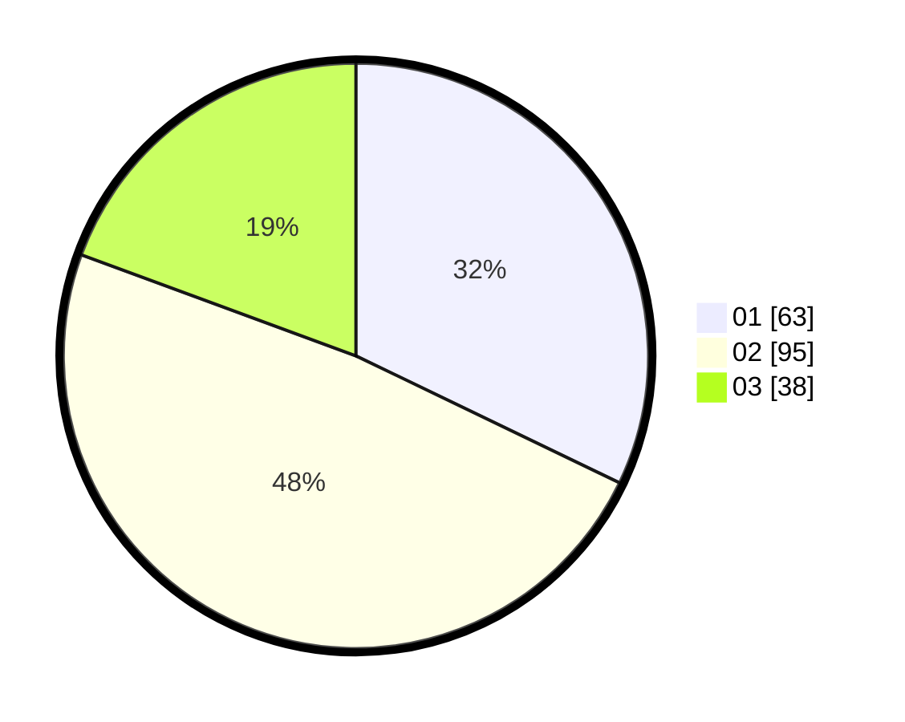

# Hasil

Hasil perolehan suara paslon dapat dilihat pada file paslon-01.txt, paslon-02.txt, dan paslon-03.txt.

Jika tidak ada, artinya data tersebut belum ada pada SIREKAP.

## Perolehan Suara

 * Paslon 01: **63**.
 * Paslon 02: **95**.
 * Paslon 03: **38**.

## Foto C Plano

https://sirekap-obj-formc.kpu.go.id/047b/pemilu/ppwp/31/75/01/10/06/3175011006101-20240214-231910--9297395f-7f1a-46e0-bc6a-6e4212f50e29.jpg

https://sirekap-obj-formc.kpu.go.id/047b/pemilu/ppwp/31/75/01/10/06/3175011006101-20240214-231925--b8e1cd36-4573-4a24-88da-c4531088cf94.jpg

https://sirekap-obj-formc.kpu.go.id/047b/pemilu/ppwp/31/75/01/10/06/3175011006101-20240214-231928--de601224-bbca-49ff-af85-e9489b556b97.jpg
