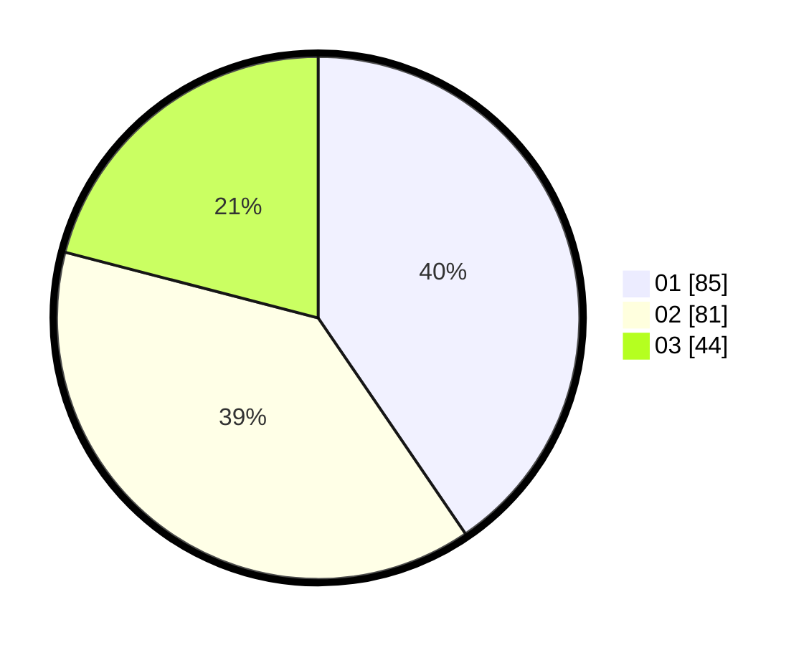

# Hasil

Hasil perolehan suara paslon dapat dilihat pada file paslon-01.txt, paslon-02.txt, dan paslon-03.txt.

Jika tidak ada, artinya data tersebut belum ada pada SIREKAP.

## Perolehan Suara

 * Paslon 01: **85**.
 * Paslon 02: **81**.
 * Paslon 03: **44**.

## Foto C Plano

https://sirekap-obj-formc.kpu.go.id/7455/pemilu/ppwp/31/75/01/10/06/3175011006105-20240214-195821--869805d3-1e4a-4698-ae0d-5210d0cf4d5a.jpg

https://sirekap-obj-formc.kpu.go.id/7455/pemilu/ppwp/31/75/01/10/06/3175011006105-20240214-195939--49ab10bd-d56a-4498-8e41-ae5dbed31905.jpg
