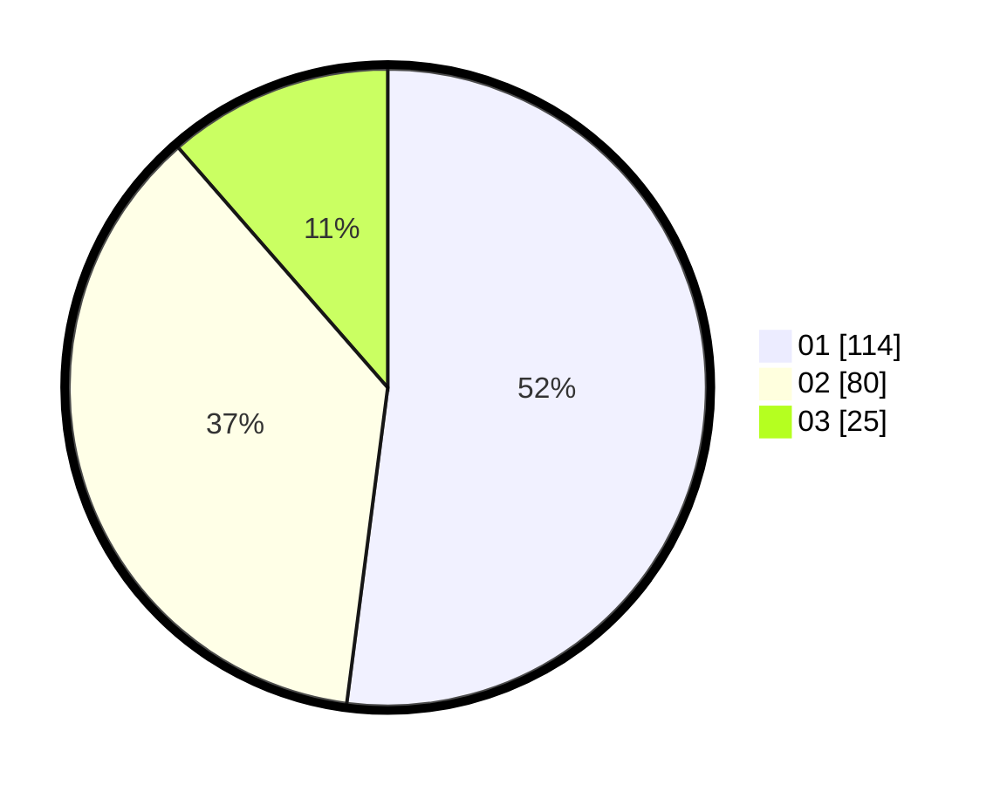

# Hasil

Hasil perolehan suara paslon dapat dilihat pada file paslon-01.txt, paslon-02.txt, dan paslon-03.txt.

Jika tidak ada, artinya data tersebut belum ada pada SIREKAP.

## Perolehan Suara

 * Paslon 01: **114**.
 * Paslon 02: **80**.
 * Paslon 03: **25**.

## Foto C Plano

https://sirekap-obj-formc.kpu.go.id/e08f/pemilu/ppwp/31/75/01/10/06/3175011006106-20240215-052038--422f9868-0b5d-41d4-838c-e6d5ee467154.jpg

https://sirekap-obj-formc.kpu.go.id/e08f/pemilu/ppwp/31/75/01/10/06/3175011006106-20240215-052200--df727a92-0d99-4387-a84c-74cf4d3acb39.jpg

https://sirekap-obj-formc.kpu.go.id/e08f/pemilu/ppwp/31/75/01/10/06/3175011006106-20240215-052242--7e33b99e-cab7-4f45-a289-03cc01d67b07.jpg
