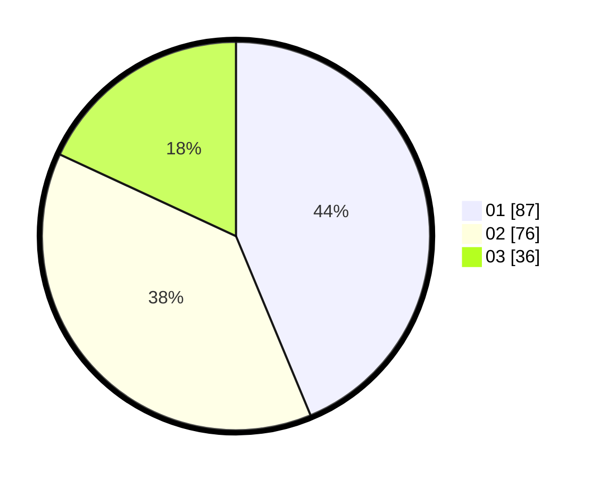

# Hasil

Hasil perolehan suara paslon dapat dilihat pada file paslon-01.txt, paslon-02.txt, dan paslon-03.txt.

Jika tidak ada, artinya data tersebut belum ada pada SIREKAP.

## Perolehan Suara

 * Paslon 01: **87**.
 * Paslon 02: **76**.
 * Paslon 03: **36**.

## Foto C Plano

https://sirekap-obj-formc.kpu.go.id/4e01/pemilu/ppwp/31/75/01/10/06/3175011006109-20240215-021137--fa3570b8-2f17-4ee6-95d9-6adab7939807.jpg

https://sirekap-obj-formc.kpu.go.id/4e01/pemilu/ppwp/31/75/01/10/06/3175011006109-20240215-021208--19189352-a5f3-4c11-a015-3d5db8f0ee50.jpg

https://sirekap-obj-formc.kpu.go.id/4e01/pemilu/ppwp/31/75/01/10/06/3175011006109-20240215-021230--284533f1-1d75-4669-b7e0-a237ebe8fc2e.jpg

## DATA PEMILIH TETAP

Jumlah pemilih dalam DPT: **259**.
 * L: **130**.
 * P: **139**.

## DATA PENGGUNA HAK PILIH

Jumlah pengguna hak pilih dalam DPT: **198**.
 * L: **100**.
 * P: **98**.

Jumlah pengguna hak pilih dalam DPTb: **2**.
 * L: **1**.
 * P: **1**.

Jumlah pengguna hak pilih dalam DPK: **2**.
 * L: **2**.
 * P: **0**.

Jumlah pengguna hak pilih: **202**.
 * L: **103**.
 * P: **99**.

## JUMLAH SUARA SAH DAN TIDAK SAH

JUMLAH SELURUH SUARA SAH: **199**.

JUMLAH SUARA TIDAK SAH: **3**.

JUMLAH SELURUH SUARA SAH DAN SUARA TIDAK SAH: **202**.
