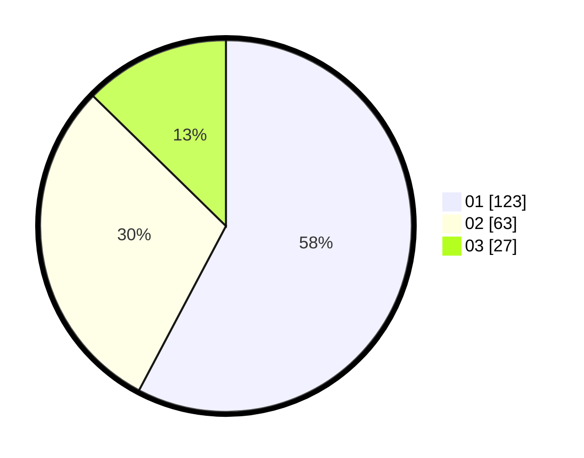

# Hasil

Hasil perolehan suara paslon dapat dilihat pada file paslon-01.txt, paslon-02.txt, dan paslon-03.txt.

Jika tidak ada, artinya data tersebut belum ada pada SIREKAP.

## Perolehan Suara

 * Paslon 01: **123**.
 * Paslon 02: **63**.
 * Paslon 03: **27**.

## Foto C Plano

https://sirekap-obj-formc.kpu.go.id/16ac/pemilu/ppwp/31/75/01/10/06/3175011006112-20240214-191904--098a5247-c082-4716-a193-b4115f455db2.jpg

https://sirekap-obj-formc.kpu.go.id/16ac/pemilu/ppwp/31/75/01/10/06/3175011006112-20240214-185434--45a1027d-dbac-4f2b-986d-436dc01d187d.jpg

https://sirekap-obj-formc.kpu.go.id/16ac/pemilu/ppwp/31/75/01/10/06/3175011006112-20240214-185453--f93a5ad5-0049-4809-af38-4356ab63fba2.jpg

## DATA PEMILIH TETAP

Jumlah pemilih dalam DPT: **238**.
 * L: **129**.
 * P: **109**.

## DATA PENGGUNA HAK PILIH

Jumlah pengguna hak pilih dalam DPT: **214**.
 * L: **117**.
 * P: **97**.

Jumlah pengguna hak pilih dalam DPTb: **1**.
 * L: **0**.
 * P: **1**.

Jumlah pengguna hak pilih dalam DPK: **0**.
 * L: **0**.
 * P: **0**.

Jumlah pengguna hak pilih: **215**.
 * L: **117**.
 * P: **98**.

## JUMLAH SUARA SAH DAN TIDAK SAH

JUMLAH SELURUH SUARA SAH: **213**.

JUMLAH SUARA TIDAK SAH: **2**.

JUMLAH SELURUH SUARA SAH DAN SUARA TIDAK SAH: **215**.
