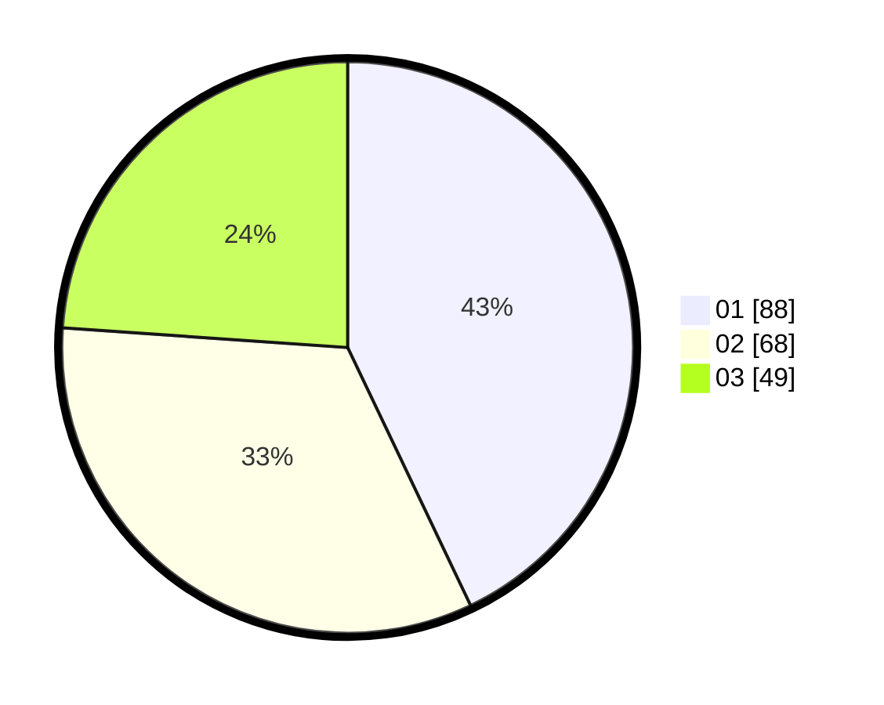

# Hasil

Hasil perolehan suara paslon dapat dilihat pada file paslon-01.txt, paslon-02.txt, dan paslon-03.txt.

Jika tidak ada, artinya data tersebut belum ada pada SIREKAP.

## Perolehan Suara

 * Paslon 01: **88**.
 * Paslon 02: **68**.
 * Paslon 03: **49**.

## Foto C Plano

https://sirekap-obj-formc.kpu.go.id/f9da/pemilu/ppwp/31/75/01/10/06/3175011006113-20240214-190154--ba260bf1-94e6-4d55-8fef-e4aeebfb15a8.jpg

https://sirekap-obj-formc.kpu.go.id/f9da/pemilu/ppwp/31/75/01/10/06/3175011006113-20240214-190626--f74b1307-2001-470c-a61c-2eeaf6f28bc9.jpg

https://sirekap-obj-formc.kpu.go.id/f9da/pemilu/ppwp/31/75/01/10/06/3175011006113-20240214-184724--c57a1b76-5590-438c-b7d3-4e0aff7aad71.jpg

## DATA PEMILIH TETAP

Jumlah pemilih dalam DPT: **241**.
 * L: **113**.
 * P: **128**.

## DATA PENGGUNA HAK PILIH

Jumlah pengguna hak pilih dalam DPT: **204**.
 * L: **92**.
 * P: **112**.

Jumlah pengguna hak pilih dalam DPTb: **3**.
 * L: **1**.
 * P: **2**.

Jumlah pengguna hak pilih dalam DPK: **0**.
 * L: **0**.
 * P: **0**.

Jumlah pengguna hak pilih: **207**.
 * L: **93**.
 * P: **114**.

## JUMLAH SUARA SAH DAN TIDAK SAH

JUMLAH SELURUH SUARA SAH: **203**.

JUMLAH SUARA TIDAK SAH: **2**.

JUMLAH SELURUH SUARA SAH DAN SUARA TIDAK SAH: **205**.
