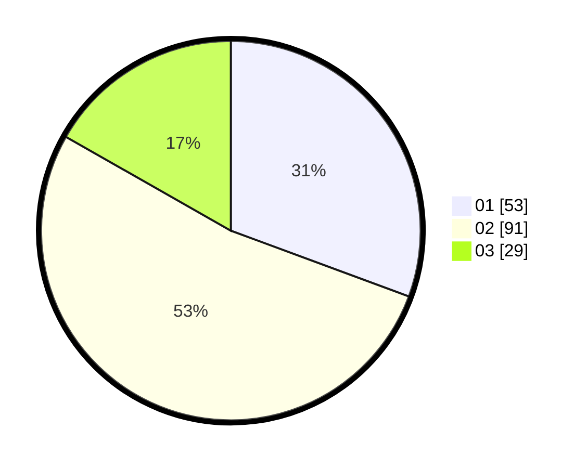

# Hasil

Hasil perolehan suara paslon dapat dilihat pada file paslon-01.txt, paslon-02.txt, dan paslon-03.txt.

Jika tidak ada, artinya data tersebut belum ada pada SIREKAP.

## Perolehan Suara

 * Paslon 01: **53**.
 * Paslon 02: **91**.
 * Paslon 03: **29**.

## Foto C Plano

https://sirekap-obj-formc.kpu.go.id/f5d4/pemilu/ppwp/31/75/02/10/01/3175021001001-20240216-143733--96462dff-58c1-4a48-a470-e345e3c2b463.jpg

https://sirekap-obj-formc.kpu.go.id/f5d4/pemilu/ppwp/31/75/02/10/01/3175021001001-20240216-143735--7a576164-1712-4ec3-bdbe-a5c2ce9be3ab.jpg

https://sirekap-obj-formc.kpu.go.id/f5d4/pemilu/ppwp/31/75/02/10/01/3175021001001-20240216-143734--9490de73-af8c-40b5-af80-e6d4d594e030.jpg

## DATA PEMILIH TETAP

Jumlah pemilih dalam DPT: **0**.
 * L: **0**.
 * P: **0**.

## DATA PENGGUNA HAK PILIH

Jumlah pengguna hak pilih dalam DPT: **0**.
 * L: **0**.
 * P: **0**.

Jumlah pengguna hak pilih dalam DPTb: **0**.
 * L: **0**.
 * P: **0**.

Jumlah pengguna hak pilih dalam DPK: **0**.
 * L: **0**.
 * P: **0**.

Jumlah pengguna hak pilih: **0**.
 * L: **0**.
 * P: **0**.

## JUMLAH SUARA SAH DAN TIDAK SAH

JUMLAH SELURUH SUARA SAH: **173**.

JUMLAH SUARA TIDAK SAH: **0**.

JUMLAH SELURUH SUARA SAH DAN SUARA TIDAK SAH: **173**.
