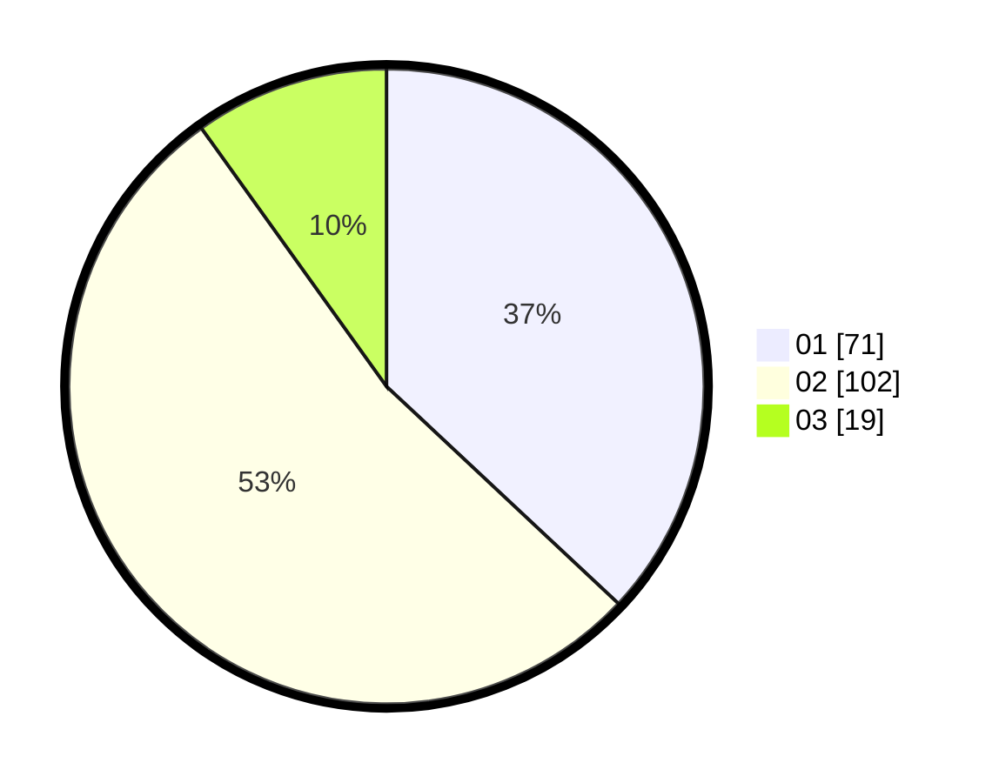

# Hasil

Hasil perolehan suara paslon dapat dilihat pada file paslon-01.txt, paslon-02.txt, dan paslon-03.txt.

Jika tidak ada, artinya data tersebut belum ada pada SIREKAP.

## Perolehan Suara

 * Paslon 01: **71**.
 * Paslon 02: **102**.
 * Paslon 03: **19**.

## Foto C Plano

https://sirekap-obj-formc.kpu.go.id/5e8a/pemilu/ppwp/31/75/02/10/01/3175021001006-20240214-162214--71680e23-463b-4b91-861e-dc76e8691e1a.jpg

https://sirekap-obj-formc.kpu.go.id/5e8a/pemilu/ppwp/31/75/02/10/01/3175021001006-20240216-072522--808b02b4-8d70-4452-a1be-c27672dd94fe.jpg

https://sirekap-obj-formc.kpu.go.id/5e8a/pemilu/ppwp/31/75/02/10/01/3175021001006-20240215-034618--02d5dd98-15ac-4fa6-b3eb-a4707afe18c7.jpg

## DATA PEMILIH TETAP

Jumlah pemilih dalam DPT: **269**.
 * L: **136**.
 * P: **133**.

## DATA PENGGUNA HAK PILIH

Jumlah pengguna hak pilih dalam DPT: **193**.
 * L: **92**.
 * P: **101**.

Jumlah pengguna hak pilih dalam DPTb: **3**.
 * L: **0**.
 * P: **3**.

Jumlah pengguna hak pilih dalam DPK: **1**.
 * L: **0**.
 * P: **1**.

Jumlah pengguna hak pilih: **197**.
 * L: **92**.
 * P: **105**.

## JUMLAH SUARA SAH DAN TIDAK SAH

JUMLAH SELURUH SUARA SAH: **192**.

JUMLAH SUARA TIDAK SAH: **5**.

JUMLAH SELURUH SUARA SAH DAN SUARA TIDAK SAH: **197**.
