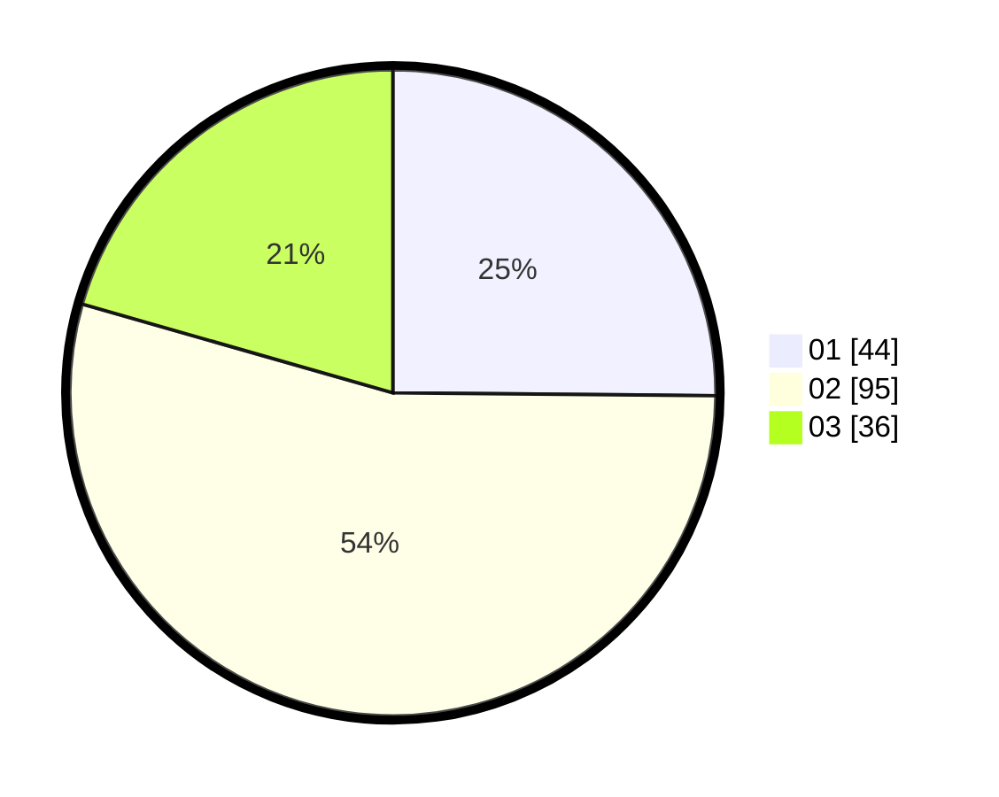

# Hasil

Hasil perolehan suara paslon dapat dilihat pada file paslon-01.txt, paslon-02.txt, dan paslon-03.txt.

Jika tidak ada, artinya data tersebut belum ada pada SIREKAP.

## Perolehan Suara

 * Paslon 01: **44**.
 * Paslon 02: **95**.
 * Paslon 03: **36**.

## Foto C Plano

https://sirekap-obj-formc.kpu.go.id/6644/pemilu/ppwp/31/75/02/10/01/3175021001013-20240216-003615--1e03f651-750d-4436-993e-30f74727cb54.jpg

https://sirekap-obj-formc.kpu.go.id/6644/pemilu/ppwp/31/75/02/10/01/3175021001013-20240216-003622--b2f4c9fa-c336-4a98-ab01-670cd34746df.jpg

https://sirekap-obj-formc.kpu.go.id/6644/pemilu/ppwp/31/75/02/10/01/3175021001013-20240216-003620--b1a0f786-95a4-437c-8020-d3a0a856024e.jpg

## DATA PEMILIH TETAP

Jumlah pemilih dalam DPT: **284**.
 * L: **144**.
 * P: **140**.

## DATA PENGGUNA HAK PILIH

Jumlah pengguna hak pilih dalam DPT: **168**.
 * L: **87**.
 * P: **81**.

Jumlah pengguna hak pilih dalam DPTb: **4**.
 * L: **2**.
 * P: **2**.

Jumlah pengguna hak pilih dalam DPK: **6**.
 * L: **4**.
 * P: **2**.

Jumlah pengguna hak pilih: **178**.
 * L: **93**.
 * P: **85**.

## JUMLAH SUARA SAH DAN TIDAK SAH

JUMLAH SELURUH SUARA SAH: **175**.

JUMLAH SUARA TIDAK SAH: **3**.

JUMLAH SELURUH SUARA SAH DAN SUARA TIDAK SAH: **178**.
