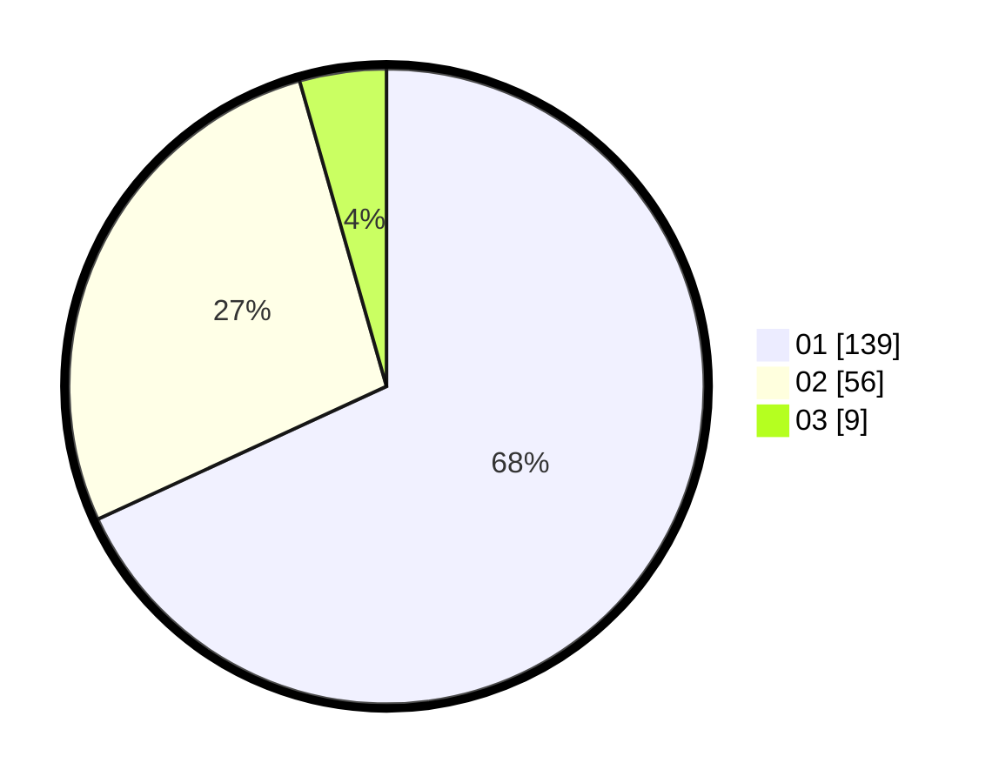

# Hasil

Hasil perolehan suara paslon dapat dilihat pada file paslon-01.txt, paslon-02.txt, dan paslon-03.txt.

Jika tidak ada, artinya data tersebut belum ada pada SIREKAP.

## Perolehan Suara

 * Paslon 01: **139**.
 * Paslon 02: **56**.
 * Paslon 03: **9**.

## Foto C Plano

https://sirekap-obj-formc.kpu.go.id/a0dd/pemilu/ppwp/31/75/02/10/01/3175021001016-20240216-132624--474216a9-82a6-4820-88a8-e0ebedceb4ee.jpg

https://sirekap-obj-formc.kpu.go.id/a0dd/pemilu/ppwp/31/75/02/10/01/3175021001016-20240216-132625--e26da8d0-69dc-4f31-a385-8695ca209881.jpg

https://sirekap-obj-formc.kpu.go.id/a0dd/pemilu/ppwp/31/75/02/10/01/3175021001016-20240216-132625--e7981e9f-5592-434b-a42d-f96b5795c127.jpg

## DATA PEMILIH TETAP

Jumlah pemilih dalam DPT: **264**.
 * L: **127**.
 * P: **137**.

## DATA PENGGUNA HAK PILIH

Jumlah pengguna hak pilih dalam DPT: **206**.
 * L: **96**.
 * P: **110**.

Jumlah pengguna hak pilih dalam DPTb: **2**.
 * L: **0**.
 * P: **2**.

Jumlah pengguna hak pilih dalam DPK: **0**.
 * L: **0**.
 * P: **0**.

Jumlah pengguna hak pilih: **208**.
 * L: **96**.
 * P: **112**.

## JUMLAH SUARA SAH DAN TIDAK SAH

JUMLAH SELURUH SUARA SAH: **204**.

JUMLAH SUARA TIDAK SAH: **4**.

JUMLAH SELURUH SUARA SAH DAN SUARA TIDAK SAH: **208**.
