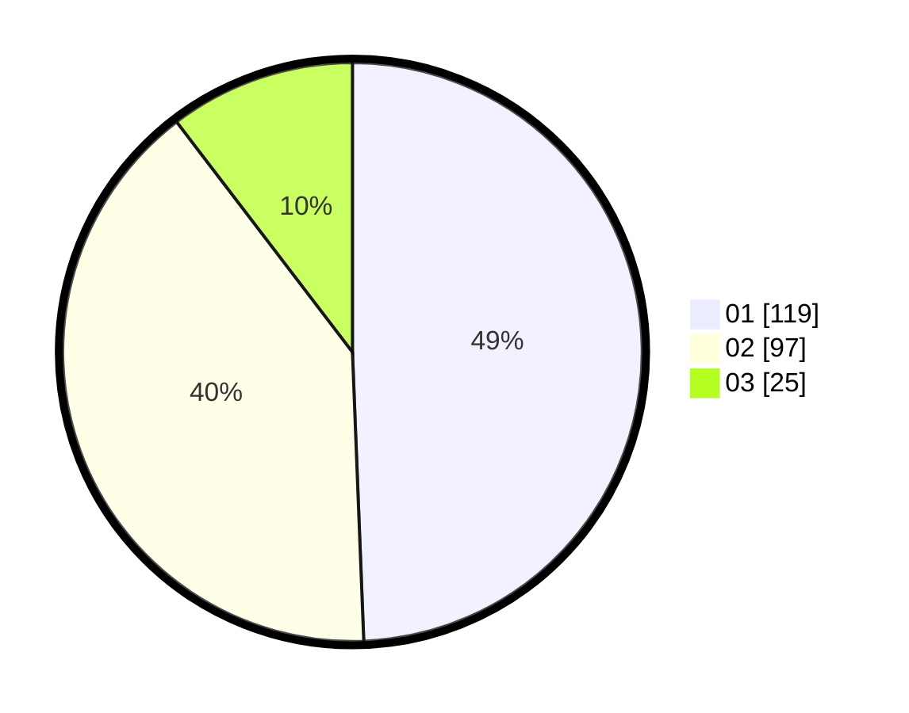

# Hasil

Hasil perolehan suara paslon dapat dilihat pada file paslon-01.txt, paslon-02.txt, dan paslon-03.txt.

Jika tidak ada, artinya data tersebut belum ada pada SIREKAP.

## Perolehan Suara

 * Paslon 01: **119**.
 * Paslon 02: **97**.
 * Paslon 03: **25**.

## Foto C Plano

https://sirekap-obj-formc.kpu.go.id/0acc/pemilu/ppwp/31/75/02/10/01/3175021001017-20240215-002848--e56ebf6e-196e-49ad-8325-8bb0123269b4.jpg

https://sirekap-obj-formc.kpu.go.id/0acc/pemilu/ppwp/31/75/02/10/01/3175021001017-20240214-223026--566e51a8-57ac-4c9a-bb98-e47b09b7e6b0.jpg

https://sirekap-obj-formc.kpu.go.id/0acc/pemilu/ppwp/31/75/02/10/01/3175021001017-20240216-073051--f4effcc5-378c-43cd-8e6b-b430c00cd918.jpg
