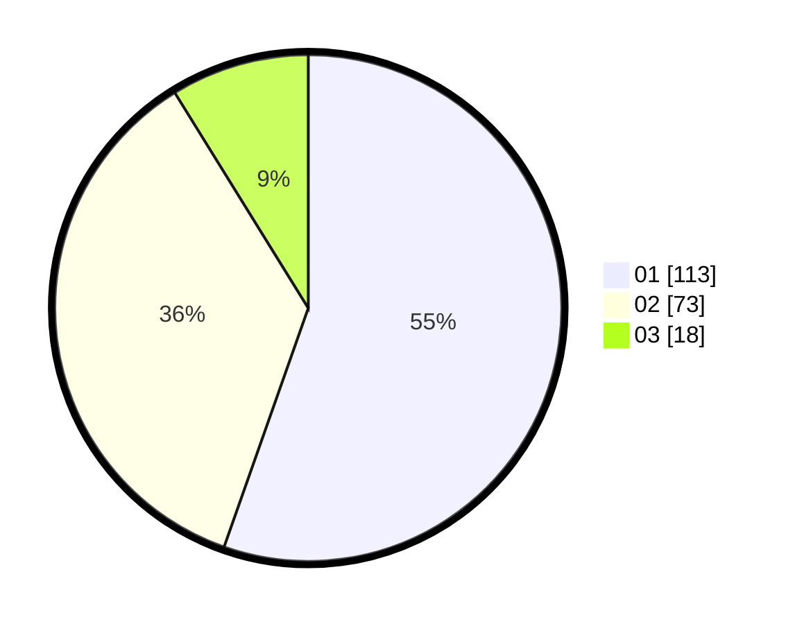

# Hasil

Hasil perolehan suara paslon dapat dilihat pada file paslon-01.txt, paslon-02.txt, dan paslon-03.txt.

Jika tidak ada, artinya data tersebut belum ada pada SIREKAP.

## Perolehan Suara

 * Paslon 01: **113**.
 * Paslon 02: **73**.
 * Paslon 03: **18**.

## Foto C Plano

https://sirekap-obj-formc.kpu.go.id/df6b/pemilu/ppwp/31/75/02/10/01/3175021001023-20240216-065943--ce8ae7de-5102-43f3-a717-fc1682f6ca9c.jpg

https://sirekap-obj-formc.kpu.go.id/df6b/pemilu/ppwp/31/75/02/10/01/3175021001023-20240216-065945--fb594ef6-5347-49d2-a758-deb83491d802.jpg

https://sirekap-obj-formc.kpu.go.id/df6b/pemilu/ppwp/31/75/02/10/01/3175021001023-20240216-114846--0fce10f9-e363-48db-8554-5703a4d29f6c.jpg

## DATA PEMILIH TETAP

Jumlah pemilih dalam DPT: **262**.
 * L: **134**.
 * P: **128**.

## DATA PENGGUNA HAK PILIH

Jumlah pengguna hak pilih dalam DPT: **196**.
 * L: **98**.
 * P: **98**.

Jumlah pengguna hak pilih dalam DPTb: **7**.
 * L: **2**.
 * P: **5**.

Jumlah pengguna hak pilih dalam DPK: **3**.
 * L: **1**.
 * P: **2**.

Jumlah pengguna hak pilih: **206**.
 * L: **101**.
 * P: **105**.

## JUMLAH SUARA SAH DAN TIDAK SAH

JUMLAH SELURUH SUARA SAH: **204**.

JUMLAH SUARA TIDAK SAH: **2**.

JUMLAH SELURUH SUARA SAH DAN SUARA TIDAK SAH: **206**.
