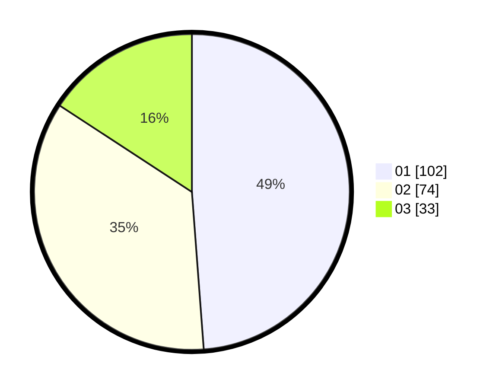

# Hasil

Hasil perolehan suara paslon dapat dilihat pada file paslon-01.txt, paslon-02.txt, dan paslon-03.txt.

Jika tidak ada, artinya data tersebut belum ada pada SIREKAP.

## Perolehan Suara

 * Paslon 01: **102**.
 * Paslon 02: **74**.
 * Paslon 03: **33**.

## Foto C Plano

https://sirekap-obj-formc.kpu.go.id/27d1/pemilu/ppwp/31/75/02/10/01/3175021001026-20240216-141815--860e9ecc-244b-4349-930e-4d847e8bd28b.jpg

https://sirekap-obj-formc.kpu.go.id/27d1/pemilu/ppwp/31/75/02/10/01/3175021001026-20240216-141816--b6146f5e-a83a-40e7-a5d2-5ce68c116513.jpg

https://sirekap-obj-formc.kpu.go.id/27d1/pemilu/ppwp/31/75/02/10/01/3175021001026-20240216-141815--b35d63dc-9b72-4a17-8be5-2d944760bd57.jpg

## DATA PEMILIH TETAP

Jumlah pemilih dalam DPT: **275**.
 * L: **151**.
 * P: **124**.

## DATA PENGGUNA HAK PILIH

Jumlah pengguna hak pilih dalam DPT: **203**.
 * L: **109**.
 * P: **94**.

Jumlah pengguna hak pilih dalam DPTb: **1**.
 * L: **0**.
 * P: **1**.

Jumlah pengguna hak pilih dalam DPK: **6**.
 * L: **3**.
 * P: **3**.

Jumlah pengguna hak pilih: **210**.
 * L: **112**.
 * P: **98**.

## JUMLAH SUARA SAH DAN TIDAK SAH

JUMLAH SELURUH SUARA SAH: **209**.

JUMLAH SUARA TIDAK SAH: **1**.

JUMLAH SELURUH SUARA SAH DAN SUARA TIDAK SAH: **210**.
