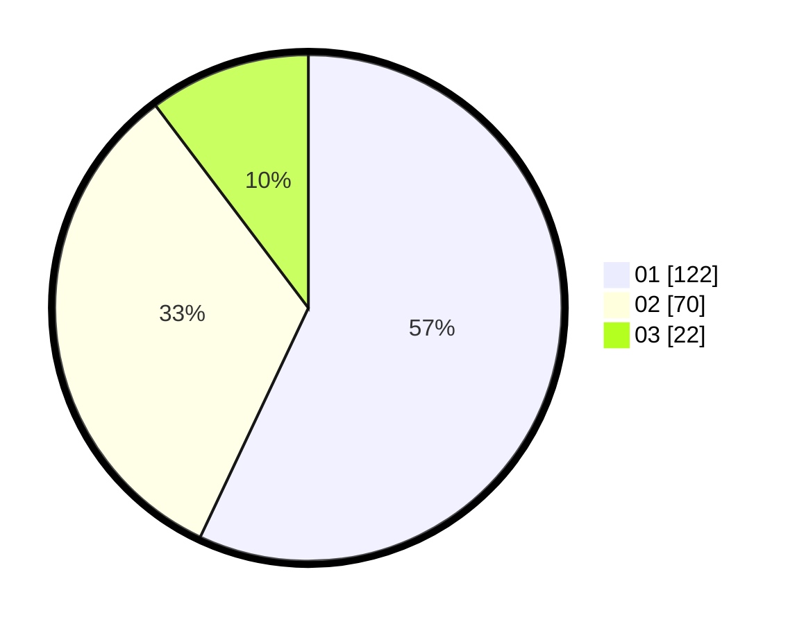

# Hasil

Hasil perolehan suara paslon dapat dilihat pada file paslon-01.txt, paslon-02.txt, dan paslon-03.txt.

Jika tidak ada, artinya data tersebut belum ada pada SIREKAP.

## Perolehan Suara

 * Paslon 01: **122**.
 * Paslon 02: **70**.
 * Paslon 03: **22**.

## Foto C Plano

https://sirekap-obj-formc.kpu.go.id/b58f/pemilu/ppwp/31/75/02/10/01/3175021001027-20240216-013742--8f4da345-4530-47f1-8cbe-bfe052ae410a.jpg

https://sirekap-obj-formc.kpu.go.id/b58f/pemilu/ppwp/31/75/02/10/01/3175021001027-20240216-013755--5ef30774-b163-4090-9f29-3947a2858d0b.jpg

https://sirekap-obj-formc.kpu.go.id/b58f/pemilu/ppwp/31/75/02/10/01/3175021001027-20240216-013749--e54a62e1-40c2-4d26-8bd3-51afae5542c5.jpg

## DATA PEMILIH TETAP

Jumlah pemilih dalam DPT: **269**.
 * L: **136**.
 * P: **133**.

## DATA PENGGUNA HAK PILIH

Jumlah pengguna hak pilih dalam DPT: **204**.
 * L: **97**.
 * P: **107**.

Jumlah pengguna hak pilih dalam DPTb: **9**.
 * L: **4**.
 * P: **5**.

Jumlah pengguna hak pilih dalam DPK: **2**.
 * L: **1**.
 * P: **1**.

Jumlah pengguna hak pilih: **215**.
 * L: **102**.
 * P: **113**.

## JUMLAH SUARA SAH DAN TIDAK SAH

JUMLAH SELURUH SUARA SAH: **214**.

JUMLAH SUARA TIDAK SAH: **1**.

JUMLAH SELURUH SUARA SAH DAN SUARA TIDAK SAH: **215**.
