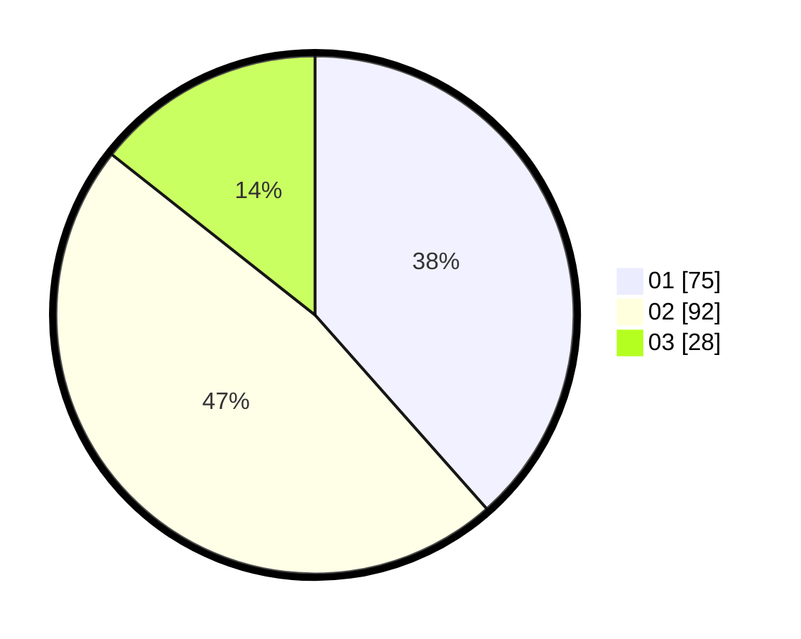

# Hasil

Hasil perolehan suara paslon dapat dilihat pada file paslon-01.txt, paslon-02.txt, dan paslon-03.txt.

Jika tidak ada, artinya data tersebut belum ada pada SIREKAP.

## Perolehan Suara

 * Paslon 01: **75**.
 * Paslon 02: **92**.
 * Paslon 03: **28**.

## Foto C Plano

https://sirekap-obj-formc.kpu.go.id/4b90/pemilu/ppwp/31/75/02/10/01/3175021001029-20240214-190522--3ca9df0a-47d0-4b7b-a7cb-477b9106d283.jpg

https://sirekap-obj-formc.kpu.go.id/4b90/pemilu/ppwp/31/75/02/10/01/3175021001029-20240214-190748--0fd5265c-b5e6-4503-901c-60628f72ac48.jpg

https://sirekap-obj-formc.kpu.go.id/4b90/pemilu/ppwp/31/75/02/10/01/3175021001029-20240214-191923--f088262c-4d30-44c9-b440-39f2170ac3d0.jpg

## DATA PEMILIH TETAP

Jumlah pemilih dalam DPT: **195**.
 * L: **99**.
 * P: **96**.

## DATA PENGGUNA HAK PILIH

Jumlah pengguna hak pilih dalam DPT: **193**.
 * L: **99**.
 * P: **94**.

Jumlah pengguna hak pilih dalam DPTb: **1**.
 * L: **0**.
 * P: **1**.

Jumlah pengguna hak pilih dalam DPK: **1**.
 * L: **0**.
 * P: **1**.

Jumlah pengguna hak pilih: **195**.
 * L: **99**.
 * P: **96**.

## JUMLAH SUARA SAH DAN TIDAK SAH

JUMLAH SELURUH SUARA SAH: **195**.

JUMLAH SUARA TIDAK SAH: **0**.

JUMLAH SELURUH SUARA SAH DAN SUARA TIDAK SAH: **195**.
