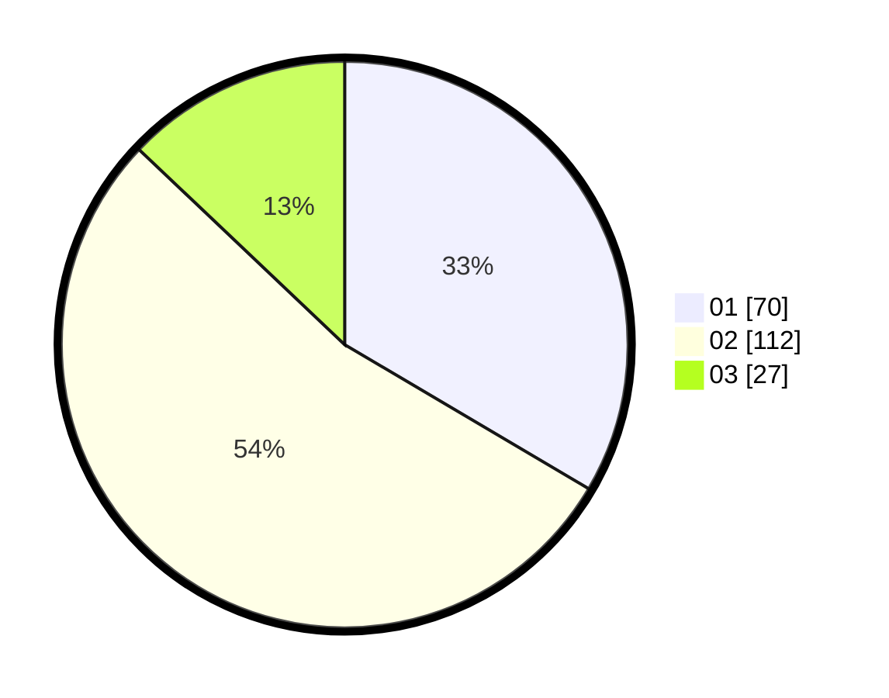

# Hasil

Hasil perolehan suara paslon dapat dilihat pada file paslon-01.txt, paslon-02.txt, dan paslon-03.txt.

Jika tidak ada, artinya data tersebut belum ada pada SIREKAP.

## Perolehan Suara

 * Paslon 01: **70**.
 * Paslon 02: **112**.
 * Paslon 03: **27**.

## Foto C Plano

https://sirekap-obj-formc.kpu.go.id/1d74/pemilu/ppwp/31/75/02/10/01/3175021001031-20240216-093808--915d18e3-0a26-424d-b551-bf1225c05413.jpg

https://sirekap-obj-formc.kpu.go.id/1d74/pemilu/ppwp/31/75/02/10/01/3175021001031-20240216-093816--8ff772ce-fbb2-42c3-b9b8-27738cb98382.jpg

https://sirekap-obj-formc.kpu.go.id/1d74/pemilu/ppwp/31/75/02/10/01/3175021001031-20240216-093811--d10a6564-2a64-4ecc-b0e2-c90b27ef3ad7.jpg

## DATA PEMILIH TETAP

Jumlah pemilih dalam DPT: **275**.
 * L: **141**.
 * P: **134**.

## DATA PENGGUNA HAK PILIH

Jumlah pengguna hak pilih dalam DPT: **216**.
 * L: **107**.
 * P: **109**.

Jumlah pengguna hak pilih dalam DPTb: **0**.
 * L: **0**.
 * P: **0**.

Jumlah pengguna hak pilih dalam DPK: **1**.
 * L: **1**.
 * P: **0**.

Jumlah pengguna hak pilih: **217**.
 * L: **108**.
 * P: **109**.

## JUMLAH SUARA SAH DAN TIDAK SAH

JUMLAH SELURUH SUARA SAH: **209**.

JUMLAH SUARA TIDAK SAH: **4**.

JUMLAH SELURUH SUARA SAH DAN SUARA TIDAK SAH: **213**.
