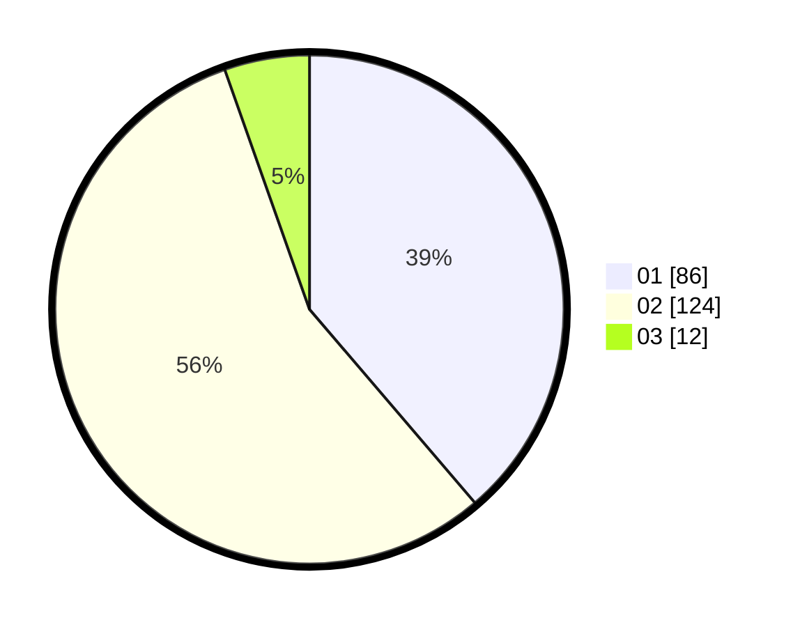

# Hasil

Hasil perolehan suara paslon dapat dilihat pada file paslon-01.txt, paslon-02.txt, dan paslon-03.txt.

Jika tidak ada, artinya data tersebut belum ada pada SIREKAP.

## Perolehan Suara

 * Paslon 01: **86**.
 * Paslon 02: **124**.
 * Paslon 03: **12**.

## Foto C Plano

https://sirekap-obj-formc.kpu.go.id/25bc/pemilu/ppwp/31/75/02/10/01/3175021001035-20240216-012734--e61778f9-6661-4c7a-a5d4-e98f40e65e49.jpg

https://sirekap-obj-formc.kpu.go.id/25bc/pemilu/ppwp/31/75/02/10/01/3175021001035-20240216-012735--e3a74507-185d-4b2e-b0ac-125a9a913ece.jpg

https://sirekap-obj-formc.kpu.go.id/25bc/pemilu/ppwp/31/75/02/10/01/3175021001035-20240216-012734--fa281dea-523f-4811-9c8e-6594de2d4c0e.jpg

## DATA PEMILIH TETAP

Jumlah pemilih dalam DPT: **285**.
 * L: **128**.
 * P: **157**.

## DATA PENGGUNA HAK PILIH

Jumlah pengguna hak pilih dalam DPT: **223**.
 * L: **95**.
 * P: **128**.

Jumlah pengguna hak pilih dalam DPTb: **0**.
 * L: **0**.
 * P: **0**.

Jumlah pengguna hak pilih dalam DPK: **2**.
 * L: **1**.
 * P: **1**.

Jumlah pengguna hak pilih: **225**.
 * L: **96**.
 * P: **129**.

## JUMLAH SUARA SAH DAN TIDAK SAH

JUMLAH SELURUH SUARA SAH: **222**.

JUMLAH SUARA TIDAK SAH: **3**.

JUMLAH SELURUH SUARA SAH DAN SUARA TIDAK SAH: **225**.
