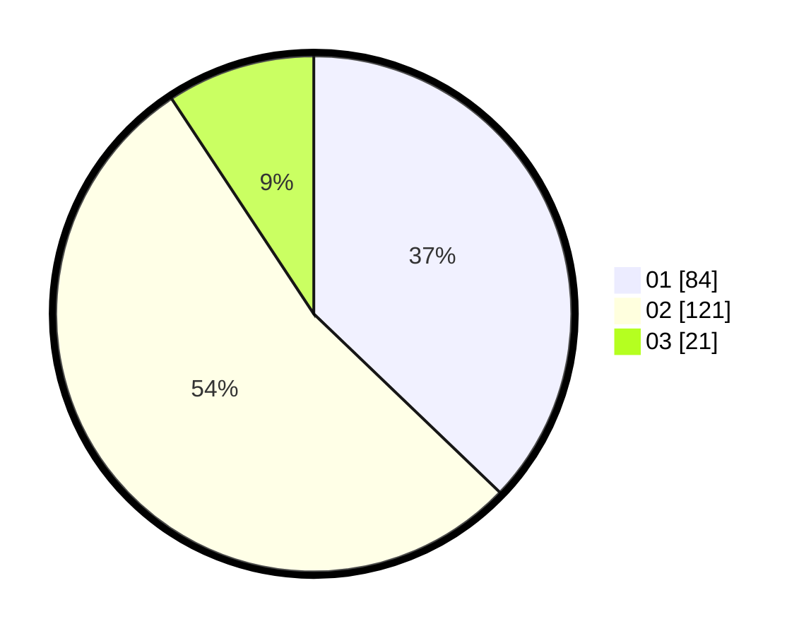

# Hasil

Hasil perolehan suara paslon dapat dilihat pada file paslon-01.txt, paslon-02.txt, dan paslon-03.txt.

Jika tidak ada, artinya data tersebut belum ada pada SIREKAP.

## Perolehan Suara

 * Paslon 01: **84**.
 * Paslon 02: **121**.
 * Paslon 03: **21**.

## Foto C Plano

https://sirekap-obj-formc.kpu.go.id/e361/pemilu/ppwp/31/75/02/10/01/3175021001036-20240214-205554--ce5a4f9c-a7ad-4a80-9543-ca0a2b0b0c6f.jpg

https://sirekap-obj-formc.kpu.go.id/e361/pemilu/ppwp/31/75/02/10/01/3175021001036-20240214-210158--b5a4040f-03f1-4890-b465-d14e63a76cff.jpg

https://sirekap-obj-formc.kpu.go.id/e361/pemilu/ppwp/31/75/02/10/01/3175021001036-20240214-210521--25121f77-5494-4967-9454-c6b9d9207289.jpg
