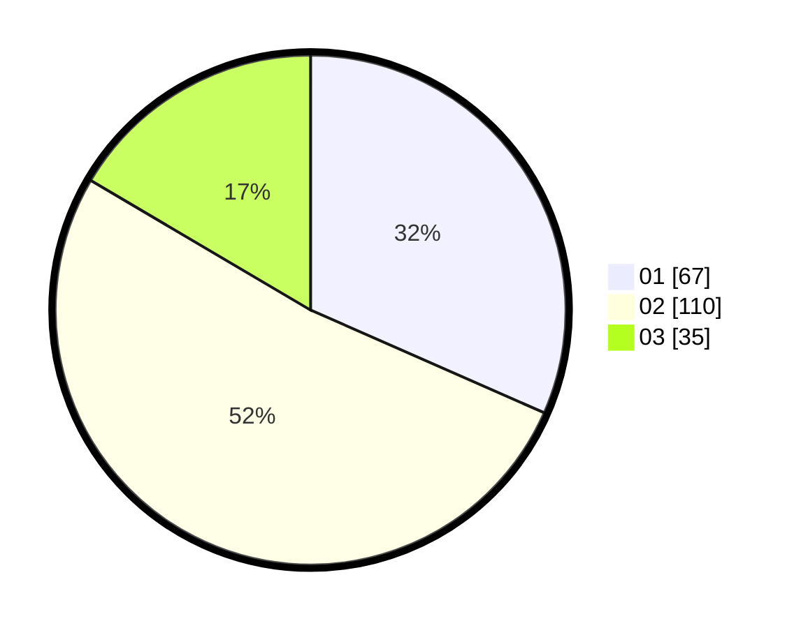

# Hasil

Hasil perolehan suara paslon dapat dilihat pada file paslon-01.txt, paslon-02.txt, dan paslon-03.txt.

Jika tidak ada, artinya data tersebut belum ada pada SIREKAP.

## Perolehan Suara

 * Paslon 01: **67**.
 * Paslon 02: **110**.
 * Paslon 03: **35**.

## Foto C Plano

https://sirekap-obj-formc.kpu.go.id/5be6/pemilu/ppwp/31/75/02/10/01/3175021001038-20240216-134529--e5c8f4bd-3c5f-431e-9525-ce8fe121039f.jpg

https://sirekap-obj-formc.kpu.go.id/5be6/pemilu/ppwp/31/75/02/10/01/3175021001038-20240216-134530--639092f9-a104-4aea-92b6-7e00553667aa.jpg

https://sirekap-obj-formc.kpu.go.id/5be6/pemilu/ppwp/31/75/02/10/01/3175021001038-20240216-134529--e98fe1cc-c14f-40bb-833f-c1138c7b0cb4.jpg

## DATA PEMILIH TETAP

Jumlah pemilih dalam DPT: **275**.
 * L: **140**.
 * P: **135**.

## DATA PENGGUNA HAK PILIH

Jumlah pengguna hak pilih dalam DPT: **210**.
 * L: **100**.
 * P: **110**.

Jumlah pengguna hak pilih dalam DPTb: **0**.
 * L: **0**.
 * P: **0**.

Jumlah pengguna hak pilih dalam DPK: **3**.
 * L: **2**.
 * P: **1**.

Jumlah pengguna hak pilih: **213**.
 * L: **102**.
 * P: **111**.

## JUMLAH SUARA SAH DAN TIDAK SAH

JUMLAH SELURUH SUARA SAH: **212**.

JUMLAH SUARA TIDAK SAH: **1**.

JUMLAH SELURUH SUARA SAH DAN SUARA TIDAK SAH: **213**.
