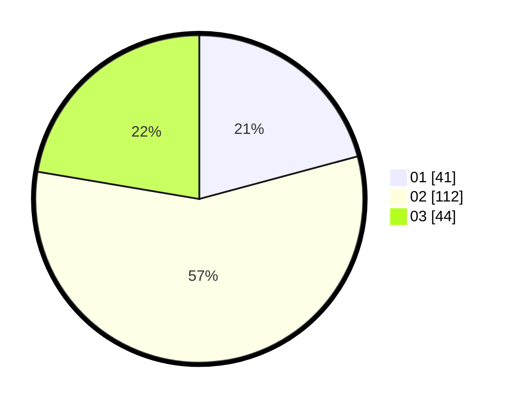

# Hasil

Hasil perolehan suara paslon dapat dilihat pada file paslon-01.txt, paslon-02.txt, dan paslon-03.txt.

Jika tidak ada, artinya data tersebut belum ada pada SIREKAP.

## Perolehan Suara

 * Paslon 01: **41**.
 * Paslon 02: **112**.
 * Paslon 03: **44**.

## Foto C Plano

https://sirekap-obj-formc.kpu.go.id/42c8/pemilu/ppwp/31/75/02/10/01/3175021001040-20240216-015248--3dc073e4-6384-471d-8443-e66631e7047a.jpg

https://sirekap-obj-formc.kpu.go.id/42c8/pemilu/ppwp/31/75/02/10/01/3175021001040-20240216-015251--5aae0f8b-b14a-42b2-b554-dbce8fa22719.jpg

https://sirekap-obj-formc.kpu.go.id/42c8/pemilu/ppwp/31/75/02/10/01/3175021001040-20240216-015249--8dbb0a3f-c88f-409e-a164-f167aca90d8a.jpg

## DATA PEMILIH TETAP

Jumlah pemilih dalam DPT: **275**.
 * L: **128**.
 * P: **147**.

## DATA PENGGUNA HAK PILIH

Jumlah pengguna hak pilih dalam DPT: **190**.
 * L: **84**.
 * P: **106**.

Jumlah pengguna hak pilih dalam DPTb: **5**.
 * L: **2**.
 * P: **3**.

Jumlah pengguna hak pilih dalam DPK: **2**.
 * L: **2**.
 * P: **0**.

Jumlah pengguna hak pilih: **197**.
 * L: **88**.
 * P: **109**.

## JUMLAH SUARA SAH DAN TIDAK SAH

JUMLAH SELURUH SUARA SAH: **197**.

JUMLAH SUARA TIDAK SAH: **1**.

JUMLAH SELURUH SUARA SAH DAN SUARA TIDAK SAH: **198**.
