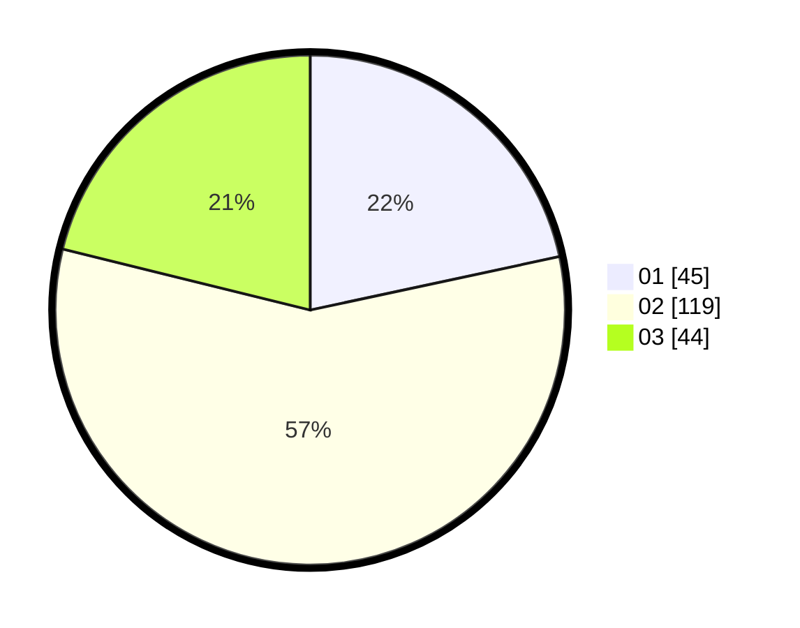

# Hasil

Hasil perolehan suara paslon dapat dilihat pada file paslon-01.txt, paslon-02.txt, dan paslon-03.txt.

Jika tidak ada, artinya data tersebut belum ada pada SIREKAP.

## Perolehan Suara

 * Paslon 01: **45**.
 * Paslon 02: **119**.
 * Paslon 03: **44**.

## Foto C Plano

https://sirekap-obj-formc.kpu.go.id/1847/pemilu/ppwp/31/75/02/10/01/3175021001041-20240216-042435--63d270e1-690a-4694-b619-9ad9a61782b1.jpg

https://sirekap-obj-formc.kpu.go.id/1847/pemilu/ppwp/31/75/02/10/01/3175021001041-20240216-042436--4131a0b7-ef22-4485-a19a-6077e2527b9f.jpg

https://sirekap-obj-formc.kpu.go.id/1847/pemilu/ppwp/31/75/02/10/01/3175021001041-20240216-042435--399edc31-68d2-46b0-a4f3-45f30faa41e8.jpg

## DATA PEMILIH TETAP

Jumlah pemilih dalam DPT: **261**.
 * L: **136**.
 * P: **125**.

## DATA PENGGUNA HAK PILIH

Jumlah pengguna hak pilih dalam DPT: **203**.
 * L: **101**.
 * P: **102**.

Jumlah pengguna hak pilih dalam DPTb: **4**.
 * L: **3**.
 * P: **1**.

Jumlah pengguna hak pilih dalam DPK: **2**.
 * L: **1**.
 * P: **1**.

Jumlah pengguna hak pilih: **209**.
 * L: **105**.
 * P: **104**.

## JUMLAH SUARA SAH DAN TIDAK SAH

JUMLAH SELURUH SUARA SAH: **208**.

JUMLAH SUARA TIDAK SAH: **1**.

JUMLAH SELURUH SUARA SAH DAN SUARA TIDAK SAH: **209**.
