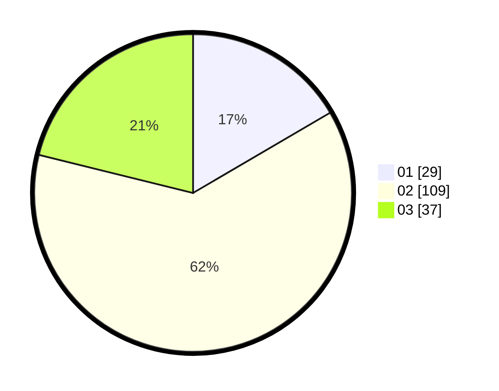

# Hasil

Hasil perolehan suara paslon dapat dilihat pada file paslon-01.txt, paslon-02.txt, dan paslon-03.txt.

Jika tidak ada, artinya data tersebut belum ada pada SIREKAP.

## Perolehan Suara

 * Paslon 01: **29**.
 * Paslon 02: **109**.
 * Paslon 03: **37**.

## Foto C Plano

https://sirekap-obj-formc.kpu.go.id/264b/pemilu/ppwp/31/75/02/10/01/3175021001043-20240216-055034--bbf371c7-3e04-4497-bbd1-f1c9a7ca6b67.jpg

https://sirekap-obj-formc.kpu.go.id/264b/pemilu/ppwp/31/75/02/10/01/3175021001043-20240216-055036--3a24bbe8-49e0-41be-877e-747bc837f912.jpg

https://sirekap-obj-formc.kpu.go.id/264b/pemilu/ppwp/31/75/02/10/01/3175021001043-20240216-055035--1216be05-b5af-4a27-af59-3989fd6d7c7f.jpg

## DATA PEMILIH TETAP

Jumlah pemilih dalam DPT: **0**.
 * L: **0**.
 * P: **0**.

## DATA PENGGUNA HAK PILIH

Jumlah pengguna hak pilih dalam DPT: **0**.
 * L: **0**.
 * P: **0**.

Jumlah pengguna hak pilih dalam DPTb: **0**.
 * L: **0**.
 * P: **0**.

Jumlah pengguna hak pilih dalam DPK: **0**.
 * L: **0**.
 * P: **0**.

Jumlah pengguna hak pilih: **0**.
 * L: **0**.
 * P: **0**.

## JUMLAH SUARA SAH DAN TIDAK SAH

JUMLAH SELURUH SUARA SAH: **175**.

JUMLAH SUARA TIDAK SAH: **5**.

JUMLAH SELURUH SUARA SAH DAN SUARA TIDAK SAH: **180**.
