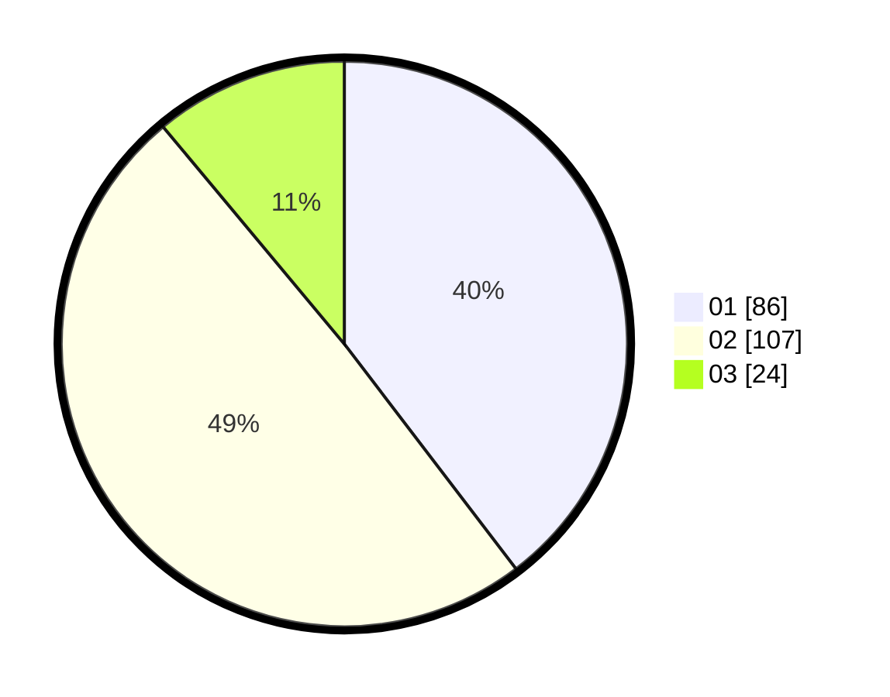

# Hasil

Hasil perolehan suara paslon dapat dilihat pada file paslon-01.txt, paslon-02.txt, dan paslon-03.txt.

Jika tidak ada, artinya data tersebut belum ada pada SIREKAP.

## Perolehan Suara

 * Paslon 01: **86**.
 * Paslon 02: **107**.
 * Paslon 03: **24**.

## Foto C Plano

https://sirekap-obj-formc.kpu.go.id/f248/pemilu/ppwp/31/75/02/10/01/3175021001045-20240215-210727--8f10c4d7-1c6a-4521-9cea-ff120cc3afcd.jpg

https://sirekap-obj-formc.kpu.go.id/f248/pemilu/ppwp/31/75/02/10/01/3175021001045-20240215-210728--87f8e19a-b3b4-4c17-8d92-5352875c7e7d.jpg

https://sirekap-obj-formc.kpu.go.id/f248/pemilu/ppwp/31/75/02/10/01/3175021001045-20240215-210727--43bb569e-6d8e-4265-9dcf-e69430f2c80b.jpg

## DATA PEMILIH TETAP

Jumlah pemilih dalam DPT: **217**.
 * L: **103**.
 * P: **114**.

## DATA PENGGUNA HAK PILIH

Jumlah pengguna hak pilih dalam DPT: **217**.
 * L: **103**.
 * P: **114**.

Jumlah pengguna hak pilih dalam DPTb: **0**.
 * L: **0**.
 * P: **0**.

Jumlah pengguna hak pilih dalam DPK: **3**.
 * L: **2**.
 * P: **1**.

Jumlah pengguna hak pilih: **220**.
 * L: **105**.
 * P: **115**.

## JUMLAH SUARA SAH DAN TIDAK SAH

JUMLAH SELURUH SUARA SAH: **217**.

JUMLAH SUARA TIDAK SAH: **3**.

JUMLAH SELURUH SUARA SAH DAN SUARA TIDAK SAH: **220**.
