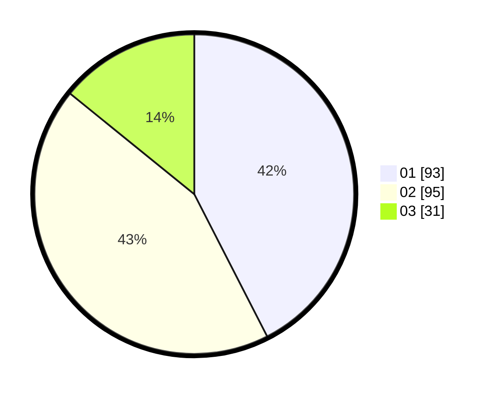

# Hasil

Hasil perolehan suara paslon dapat dilihat pada file paslon-01.txt, paslon-02.txt, dan paslon-03.txt.

Jika tidak ada, artinya data tersebut belum ada pada SIREKAP.

## Perolehan Suara

 * Paslon 01: **93**.
 * Paslon 02: **95**.
 * Paslon 03: **31**.

## Foto C Plano

https://sirekap-obj-formc.kpu.go.id/9365/pemilu/ppwp/31/75/02/10/01/3175021001049-20240216-001719--a3303866-f736-4cfd-a9b8-e6a823c0332d.jpg

https://sirekap-obj-formc.kpu.go.id/9365/pemilu/ppwp/31/75/02/10/01/3175021001049-20240216-001721--06fd4577-5fc8-4a16-a5d9-90ca5ea297b1.jpg

https://sirekap-obj-formc.kpu.go.id/9365/pemilu/ppwp/31/75/02/10/01/3175021001049-20240216-001720--06f78a32-835e-4a2c-898e-859674e2057b.jpg

## DATA PEMILIH TETAP

Jumlah pemilih dalam DPT: **221**.
 * L: **110**.
 * P: **111**.

## DATA PENGGUNA HAK PILIH

Jumlah pengguna hak pilih dalam DPT: **221**.
 * L: **110**.
 * P: **111**.

Jumlah pengguna hak pilih dalam DPTb: **0**.
 * L: **0**.
 * P: **0**.

Jumlah pengguna hak pilih dalam DPK: **0**.
 * L: **0**.
 * P: **0**.

Jumlah pengguna hak pilih: **221**.
 * L: **110**.
 * P: **111**.

## JUMLAH SUARA SAH DAN TIDAK SAH

JUMLAH SELURUH SUARA SAH: **219**.

JUMLAH SUARA TIDAK SAH: **2**.

JUMLAH SELURUH SUARA SAH DAN SUARA TIDAK SAH: **221**.
