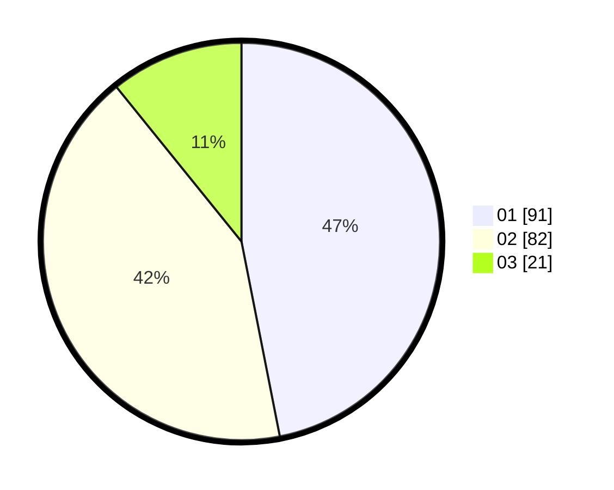

# Hasil

Hasil perolehan suara paslon dapat dilihat pada file paslon-01.txt, paslon-02.txt, dan paslon-03.txt.

Jika tidak ada, artinya data tersebut belum ada pada SIREKAP.

## Perolehan Suara

 * Paslon 01: **91**.
 * Paslon 02: **82**.
 * Paslon 03: **21**.

## Foto C Plano

https://sirekap-obj-formc.kpu.go.id/46de/pemilu/ppwp/31/75/02/10/01/3175021001050-20240214-211429--9b35ac9c-f71c-443f-8893-25751f9fa500.jpg

https://sirekap-obj-formc.kpu.go.id/46de/pemilu/ppwp/31/75/02/10/01/3175021001050-20240214-195528--45a9525a-ee67-4995-86c0-535423f0d3eb.jpg

https://sirekap-obj-formc.kpu.go.id/46de/pemilu/ppwp/31/75/02/10/01/3175021001050-20240214-202325--98f25275-e18a-4fa7-a5cb-68d4340a2ac2.jpg
