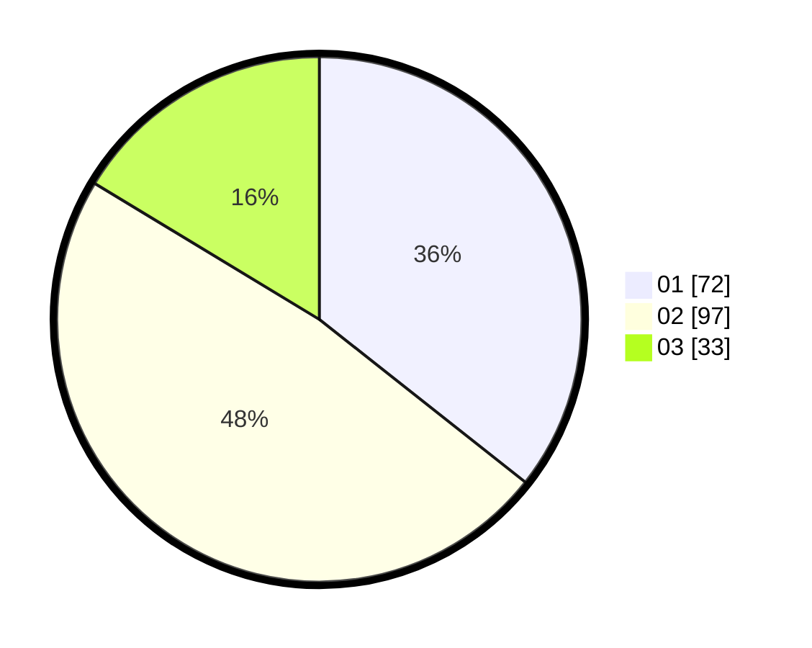

# Hasil

Hasil perolehan suara paslon dapat dilihat pada file paslon-01.txt, paslon-02.txt, dan paslon-03.txt.

Jika tidak ada, artinya data tersebut belum ada pada SIREKAP.

## Perolehan Suara

 * Paslon 01: **72**.
 * Paslon 02: **97**.
 * Paslon 03: **33**.

## Foto C Plano

https://sirekap-obj-formc.kpu.go.id/fcd0/pemilu/ppwp/31/75/02/10/01/3175021001051-20240214-190917--f57b00de-c905-4dbd-8103-52a9986ab2e3.jpg

https://sirekap-obj-formc.kpu.go.id/fcd0/pemilu/ppwp/31/75/02/10/01/3175021001051-20240214-192257--5033e1fb-4daa-42c8-a2e9-3918c447d2ba.jpg

https://sirekap-obj-formc.kpu.go.id/fcd0/pemilu/ppwp/31/75/02/10/01/3175021001051-20240214-192627--16b9b96f-519b-406b-a907-20b8c10af652.jpg

## DATA PEMILIH TETAP

Jumlah pemilih dalam DPT: **269**.
 * L: **134**.
 * P: **135**.

## DATA PENGGUNA HAK PILIH

Jumlah pengguna hak pilih dalam DPT: **207**.
 * L: **96**.
 * P: **111**.

Jumlah pengguna hak pilih dalam DPTb: **0**.
 * L: **0**.
 * P: **0**.

Jumlah pengguna hak pilih dalam DPK: **0**.
 * L: **0**.
 * P: **0**.

Jumlah pengguna hak pilih: **207**.
 * L: **0**.
 * P: **0**.

## JUMLAH SUARA SAH DAN TIDAK SAH

JUMLAH SELURUH SUARA SAH: **202**.

JUMLAH SUARA TIDAK SAH: **5**.

JUMLAH SELURUH SUARA SAH DAN SUARA TIDAK SAH: **207**.
