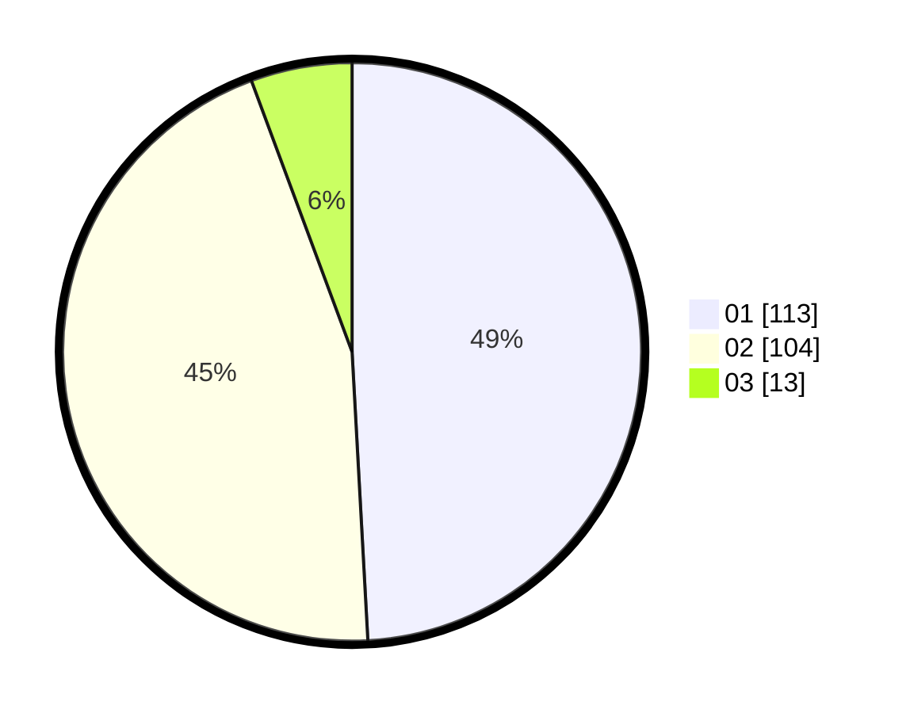

# Hasil

Hasil perolehan suara paslon dapat dilihat pada file paslon-01.txt, paslon-02.txt, dan paslon-03.txt.

Jika tidak ada, artinya data tersebut belum ada pada SIREKAP.

## Perolehan Suara

 * Paslon 01: **113**.
 * Paslon 02: **104**.
 * Paslon 03: **13**.

## Foto C Plano

https://sirekap-obj-formc.kpu.go.id/19ed/pemilu/ppwp/31/75/02/10/01/3175021001056-20240216-005333--0c04e6bf-fcb7-4fe6-8046-170c6046bd3e.jpg

https://sirekap-obj-formc.kpu.go.id/19ed/pemilu/ppwp/31/75/02/10/01/3175021001056-20240216-005340--add66d30-2796-4e5a-a5b4-3b13081507bb.jpg

https://sirekap-obj-formc.kpu.go.id/19ed/pemilu/ppwp/31/75/02/10/01/3175021001056-20240216-005339--0501654f-63d7-482e-aadf-5fddca7d4403.jpg

## DATA PEMILIH TETAP

Jumlah pemilih dalam DPT: **266**.
 * L: **136**.
 * P: **130**.

## DATA PENGGUNA HAK PILIH

Jumlah pengguna hak pilih dalam DPT: **234**.
 * L: **117**.
 * P: **117**.

Jumlah pengguna hak pilih dalam DPTb: **0**.
 * L: **0**.
 * P: **0**.

Jumlah pengguna hak pilih dalam DPK: **0**.
 * L: **0**.
 * P: **0**.

Jumlah pengguna hak pilih: **234**.
 * L: **117**.
 * P: **117**.

## JUMLAH SUARA SAH DAN TIDAK SAH

JUMLAH SELURUH SUARA SAH: **230**.

JUMLAH SUARA TIDAK SAH: **4**.

JUMLAH SELURUH SUARA SAH DAN SUARA TIDAK SAH: **234**.
