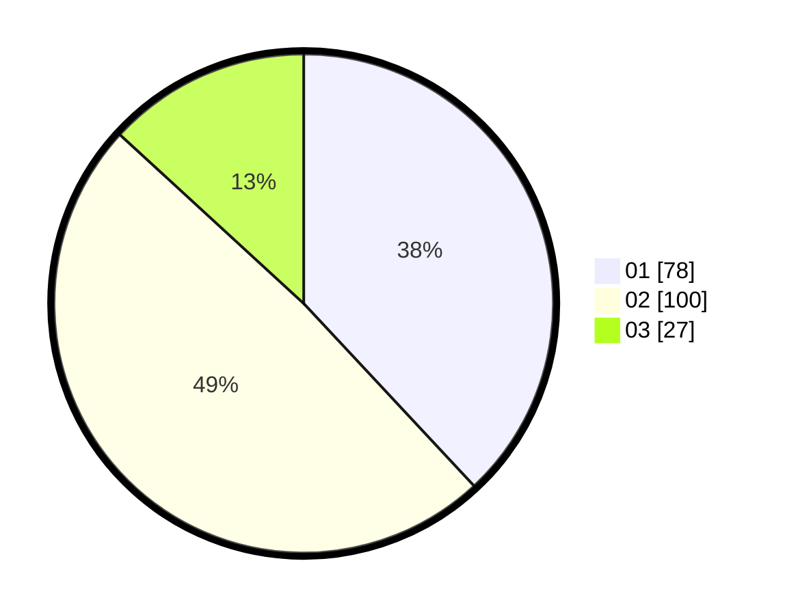

# Hasil

Hasil perolehan suara paslon dapat dilihat pada file paslon-01.txt, paslon-02.txt, dan paslon-03.txt.

Jika tidak ada, artinya data tersebut belum ada pada SIREKAP.

## Perolehan Suara

 * Paslon 01: **78**.
 * Paslon 02: **100**.
 * Paslon 03: **27**.

## Foto C Plano

https://sirekap-obj-formc.kpu.go.id/077d/pemilu/ppwp/31/75/02/10/01/3175021001057-20240215-183140--1236fada-b2aa-4e6c-905b-7af3d14966b2.jpg

https://sirekap-obj-formc.kpu.go.id/077d/pemilu/ppwp/31/75/02/10/01/3175021001057-20240215-183201--12824cd9-f1c5-4a30-849e-f7e9f6bbe0d8.jpg

https://sirekap-obj-formc.kpu.go.id/077d/pemilu/ppwp/31/75/02/10/01/3175021001057-20240215-183150--df48ac90-2d01-469b-ba0d-28c2b2a33f3e.jpg

## DATA PEMILIH TETAP

Jumlah pemilih dalam DPT: **256**.
 * L: **124**.
 * P: **132**.

## DATA PENGGUNA HAK PILIH

Jumlah pengguna hak pilih dalam DPT: **203**.
 * L: **101**.
 * P: **102**.

Jumlah pengguna hak pilih dalam DPTb: **0**.
 * L: **0**.
 * P: **0**.

Jumlah pengguna hak pilih dalam DPK: **2**.
 * L: **0**.
 * P: **2**.

Jumlah pengguna hak pilih: **205**.
 * L: **101**.
 * P: **104**.

## JUMLAH SUARA SAH DAN TIDAK SAH

JUMLAH SELURUH SUARA SAH: **205**.

JUMLAH SUARA TIDAK SAH: **0**.

JUMLAH SELURUH SUARA SAH DAN SUARA TIDAK SAH: **205**.
