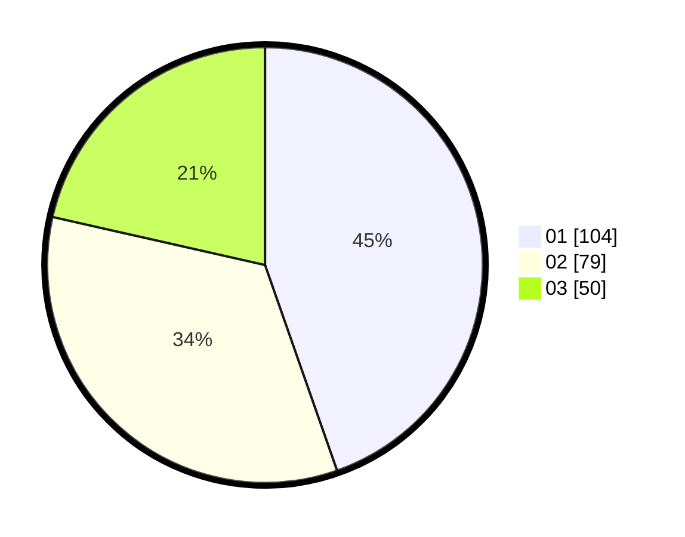

# Hasil

Hasil perolehan suara paslon dapat dilihat pada file paslon-01.txt, paslon-02.txt, dan paslon-03.txt.

Jika tidak ada, artinya data tersebut belum ada pada SIREKAP.

## Perolehan Suara

 * Paslon 01: **104**.
 * Paslon 02: **79**.
 * Paslon 03: **50**.

## Foto C Plano

https://sirekap-obj-formc.kpu.go.id/68d4/pemilu/ppwp/31/75/02/10/01/3175021001058-20240216-053326--f66fbcbf-5c66-48f0-b9c7-416456eb5c7b.jpg

https://sirekap-obj-formc.kpu.go.id/68d4/pemilu/ppwp/31/75/02/10/01/3175021001058-20240216-053328--8ef44547-54bb-40d8-9271-2b899fed9da2.jpg

https://sirekap-obj-formc.kpu.go.id/68d4/pemilu/ppwp/31/75/02/10/01/3175021001058-20240216-053327--ef2b4872-d898-40ac-9b08-e32f9689a43a.jpg

## DATA PEMILIH TETAP

Jumlah pemilih dalam DPT: **287**.
 * L: **138**.
 * P: **149**.

## DATA PENGGUNA HAK PILIH

Jumlah pengguna hak pilih dalam DPT: **237**.
 * L: **128**.
 * P: **109**.

Jumlah pengguna hak pilih dalam DPTb: **0**.
 * L: **0**.
 * P: **0**.

Jumlah pengguna hak pilih dalam DPK: **3**.
 * L: **1**.
 * P: **2**.

Jumlah pengguna hak pilih: **240**.
 * L: **129**.
 * P: **111**.

## JUMLAH SUARA SAH DAN TIDAK SAH

JUMLAH SELURUH SUARA SAH: **233**.

JUMLAH SUARA TIDAK SAH: **7**.

JUMLAH SELURUH SUARA SAH DAN SUARA TIDAK SAH: **240**.
