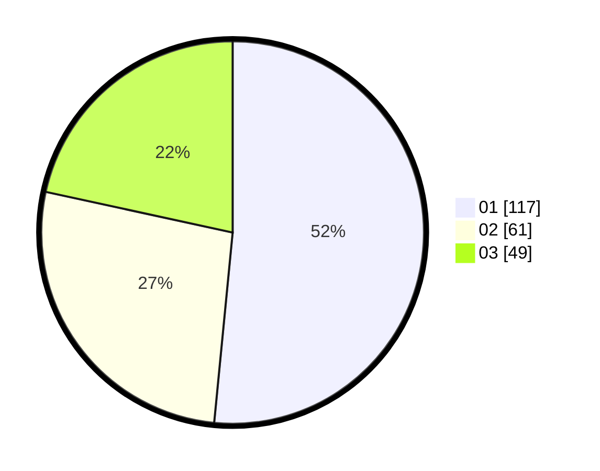

# Hasil

Hasil perolehan suara paslon dapat dilihat pada file paslon-01.txt, paslon-02.txt, dan paslon-03.txt.

Jika tidak ada, artinya data tersebut belum ada pada SIREKAP.

## Perolehan Suara

 * Paslon 01: **117**.
 * Paslon 02: **61**.
 * Paslon 03: **49**.

## Foto C Plano

https://sirekap-obj-formc.kpu.go.id/d9df/pemilu/ppwp/31/75/02/10/01/3175021001059-20240216-060706--58fcf825-8b3b-4822-bc26-775a2490e4cf.jpg

https://sirekap-obj-formc.kpu.go.id/d9df/pemilu/ppwp/31/75/02/10/01/3175021001059-20240216-054427--07f11f7f-aa21-4847-a6e1-7900b5b08693.jpg

https://sirekap-obj-formc.kpu.go.id/d9df/pemilu/ppwp/31/75/02/10/01/3175021001059-20240216-054423--d4ff1142-e93b-484c-a493-2e9ac0e562ec.jpg

## DATA PEMILIH TETAP

Jumlah pemilih dalam DPT: **290**.
 * L: **139**.
 * P: **151**.

## DATA PENGGUNA HAK PILIH

Jumlah pengguna hak pilih dalam DPT: **229**.
 * L: **111**.
 * P: **118**.

Jumlah pengguna hak pilih dalam DPTb: **2**.
 * L: **1**.
 * P: **1**.

Jumlah pengguna hak pilih dalam DPK: **2**.
 * L: **0**.
 * P: **2**.

Jumlah pengguna hak pilih: **233**.
 * L: **112**.
 * P: **121**.

## JUMLAH SUARA SAH DAN TIDAK SAH

JUMLAH SELURUH SUARA SAH: **227**.

JUMLAH SUARA TIDAK SAH: **6**.

JUMLAH SELURUH SUARA SAH DAN SUARA TIDAK SAH: **233**.
