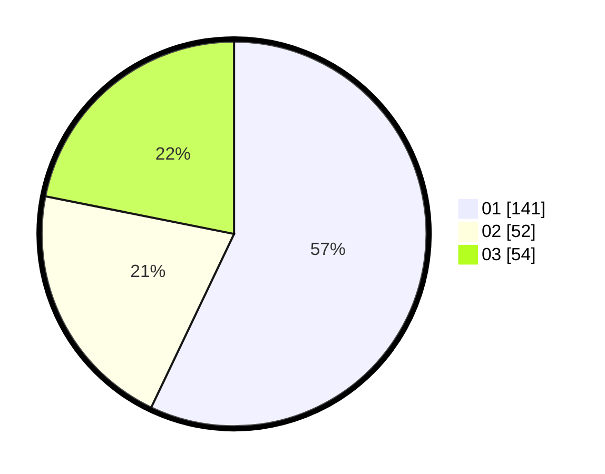

# Hasil

Hasil perolehan suara paslon dapat dilihat pada file paslon-01.txt, paslon-02.txt, dan paslon-03.txt.

Jika tidak ada, artinya data tersebut belum ada pada SIREKAP.

## Perolehan Suara

 * Paslon 01: **141**.
 * Paslon 02: **52**.
 * Paslon 03: **54**.

## Foto C Plano

https://sirekap-obj-formc.kpu.go.id/d683/pemilu/ppwp/31/75/02/10/01/3175021001061-20240214-200642--8297a199-5bf1-4a78-9ac1-433588d618af.jpg

https://sirekap-obj-formc.kpu.go.id/d683/pemilu/ppwp/31/75/02/10/01/3175021001061-20240214-200706--66b580cf-1fa0-41ec-9689-c482b82450c2.jpg

https://sirekap-obj-formc.kpu.go.id/d683/pemilu/ppwp/31/75/02/10/01/3175021001061-20240214-200729--d650df80-9b5c-4b4a-80b1-444c8307621e.jpg

## DATA PEMILIH TETAP

Jumlah pemilih dalam DPT: **296**.
 * L: **128**.
 * P: **168**.

## DATA PENGGUNA HAK PILIH

Jumlah pengguna hak pilih dalam DPT: **245**.
 * L: **108**.
 * P: **137**.

Jumlah pengguna hak pilih dalam DPTb: **5**.
 * L: **2**.
 * P: **3**.

Jumlah pengguna hak pilih dalam DPK: **1**.
 * L: **0**.
 * P: **1**.

Jumlah pengguna hak pilih: **251**.
 * L: **110**.
 * P: **141**.

## JUMLAH SUARA SAH DAN TIDAK SAH

JUMLAH SELURUH SUARA SAH: **247**.

JUMLAH SUARA TIDAK SAH: **4**.

JUMLAH SELURUH SUARA SAH DAN SUARA TIDAK SAH: **251**.
