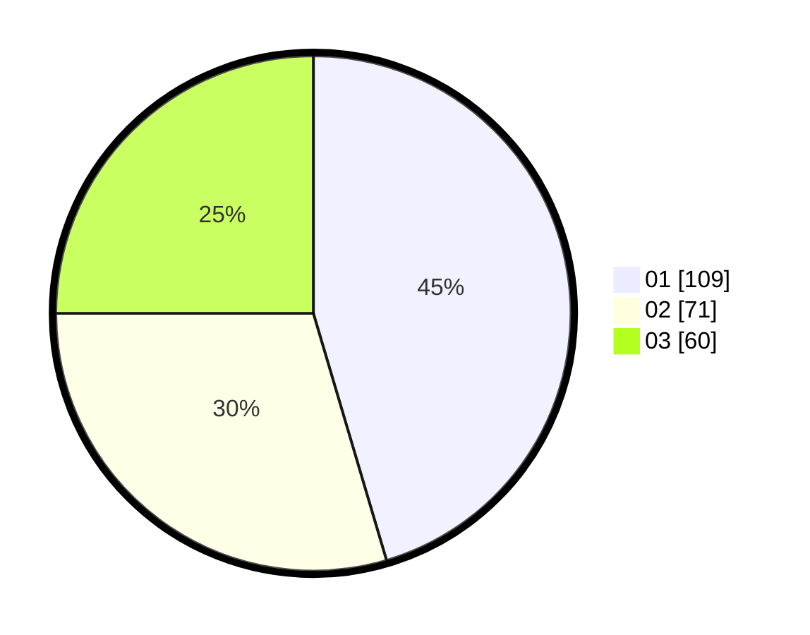

# Hasil

Hasil perolehan suara paslon dapat dilihat pada file paslon-01.txt, paslon-02.txt, dan paslon-03.txt.

Jika tidak ada, artinya data tersebut belum ada pada SIREKAP.

## Perolehan Suara

 * Paslon 01: **109**.
 * Paslon 02: **71**.
 * Paslon 03: **60**.

## Foto C Plano

https://sirekap-obj-formc.kpu.go.id/f542/pemilu/ppwp/31/75/02/10/01/3175021001063-20240215-041224--eef1359b-e3a3-4dfe-bdd1-38c2626f474b.jpg

https://sirekap-obj-formc.kpu.go.id/f542/pemilu/ppwp/31/75/02/10/01/3175021001063-20240215-041444--97eaddbe-6f9e-411d-875a-fa6ec1714259.jpg

https://sirekap-obj-formc.kpu.go.id/f542/pemilu/ppwp/31/75/02/10/01/3175021001063-20240215-041606--a89b2983-17b1-49ba-8cb3-da8a7079dc51.jpg
