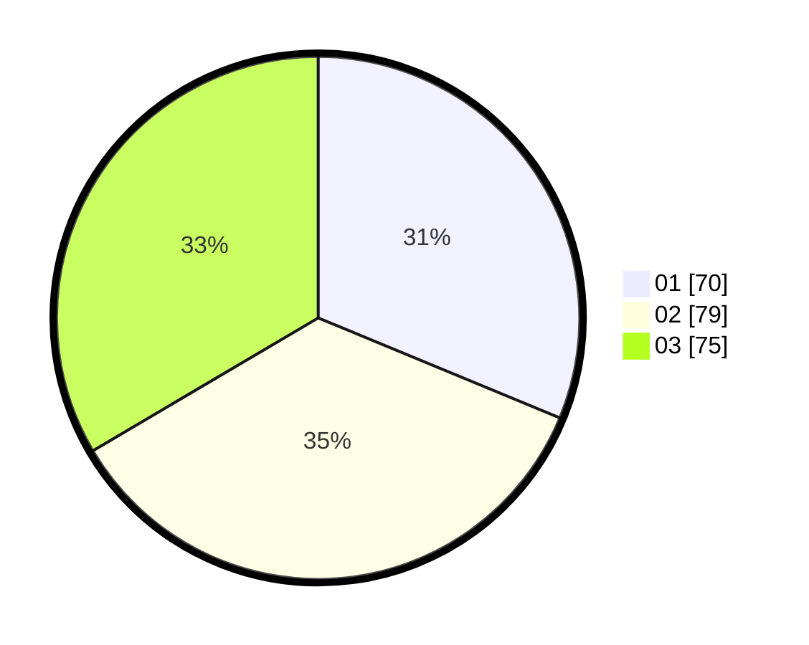

# Hasil

Hasil perolehan suara paslon dapat dilihat pada file paslon-01.txt, paslon-02.txt, dan paslon-03.txt.

Jika tidak ada, artinya data tersebut belum ada pada SIREKAP.

## Perolehan Suara

 * Paslon 01: **70**.
 * Paslon 02: **79**.
 * Paslon 03: **75**.

## Foto C Plano

https://sirekap-obj-formc.kpu.go.id/76f5/pemilu/ppwp/31/75/02/10/01/3175021001065-20240215-231530--4013fe35-dbd1-4c9d-81df-2e37c0b733e7.jpg

https://sirekap-obj-formc.kpu.go.id/76f5/pemilu/ppwp/31/75/02/10/01/3175021001065-20240215-231533--45bb051a-b43c-4053-8a84-87abb5c459b5.jpg

https://sirekap-obj-formc.kpu.go.id/76f5/pemilu/ppwp/31/75/02/10/01/3175021001065-20240215-231531--956c6e48-c3ec-465b-be85-b96dfa76010a.jpg

## DATA PEMILIH TETAP

Jumlah pemilih dalam DPT: **295**.
 * L: **146**.
 * P: **149**.

## DATA PENGGUNA HAK PILIH

Jumlah pengguna hak pilih dalam DPT: **228**.
 * L: **109**.
 * P: **119**.

Jumlah pengguna hak pilih dalam DPTb: **3**.
 * L: **0**.
 * P: **3**.

Jumlah pengguna hak pilih dalam DPK: **7**.
 * L: **2**.
 * P: **5**.

Jumlah pengguna hak pilih: **238**.
 * L: **111**.
 * P: **127**.

## JUMLAH SUARA SAH DAN TIDAK SAH

JUMLAH SELURUH SUARA SAH: **224**.

JUMLAH SUARA TIDAK SAH: **14**.

JUMLAH SELURUH SUARA SAH DAN SUARA TIDAK SAH: **238**.
