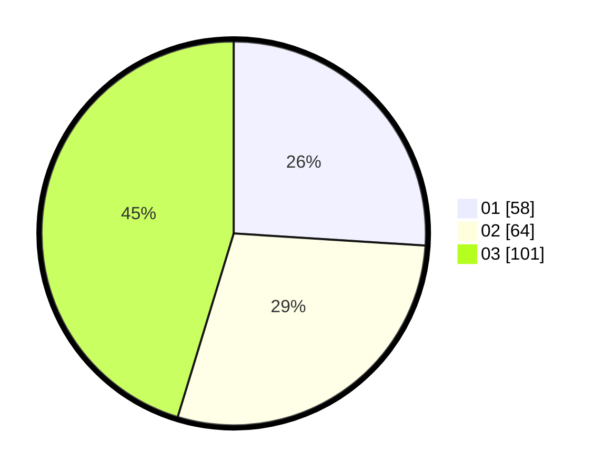

# Hasil

Hasil perolehan suara paslon dapat dilihat pada file paslon-01.txt, paslon-02.txt, dan paslon-03.txt.

Jika tidak ada, artinya data tersebut belum ada pada SIREKAP.

## Perolehan Suara

 * Paslon 01: **58**.
 * Paslon 02: **64**.
 * Paslon 03: **101**.

## Foto C Plano

https://sirekap-obj-formc.kpu.go.id/1169/pemilu/ppwp/31/75/02/10/01/3175021001066-20240214-211505--7e7950e0-dc90-47a2-b293-8126610aba97.jpg

https://sirekap-obj-formc.kpu.go.id/1169/pemilu/ppwp/31/75/02/10/01/3175021001066-20240214-211625--fbdaf085-ac3f-4029-a282-e5036d94e5aa.jpg

https://sirekap-obj-formc.kpu.go.id/1169/pemilu/ppwp/31/75/02/10/01/3175021001066-20240214-231824--04bc2db5-14b4-499b-b3da-33ee1f1a6ec0.jpg
