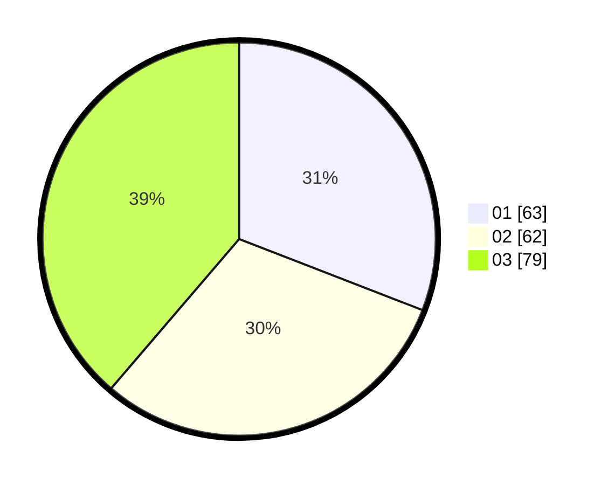

# Hasil

Hasil perolehan suara paslon dapat dilihat pada file paslon-01.txt, paslon-02.txt, dan paslon-03.txt.

Jika tidak ada, artinya data tersebut belum ada pada SIREKAP.

## Perolehan Suara

 * Paslon 01: **63**.
 * Paslon 02: **62**.
 * Paslon 03: **79**.

## Foto C Plano

https://sirekap-obj-formc.kpu.go.id/78e9/pemilu/ppwp/31/75/02/10/01/3175021001068-20240216-144518--610d2dd9-8f5d-449d-a7ef-979deb7aeaf3.jpg

https://sirekap-obj-formc.kpu.go.id/78e9/pemilu/ppwp/31/75/02/10/01/3175021001068-20240216-144519--7c7eee5b-6781-44e2-bb9e-11828143970b.jpg

https://sirekap-obj-formc.kpu.go.id/78e9/pemilu/ppwp/31/75/02/10/01/3175021001068-20240216-144518--b834fd57-78f2-4f51-8b31-5fae741b55d0.jpg

## DATA PEMILIH TETAP

Jumlah pemilih dalam DPT: **0**.
 * L: **0**.
 * P: **0**.

## DATA PENGGUNA HAK PILIH

Jumlah pengguna hak pilih dalam DPT: **208**.
 * L: **107**.
 * P: **101**.

Jumlah pengguna hak pilih dalam DPTb: **0**.
 * L: **0**.
 * P: **0**.

Jumlah pengguna hak pilih dalam DPK: **1**.
 * L: **1**.
 * P: **0**.

Jumlah pengguna hak pilih: **209**.
 * L: **108**.
 * P: **101**.

## JUMLAH SUARA SAH DAN TIDAK SAH

JUMLAH SELURUH SUARA SAH: **204**.

JUMLAH SUARA TIDAK SAH: **5**.

JUMLAH SELURUH SUARA SAH DAN SUARA TIDAK SAH: **209**.
