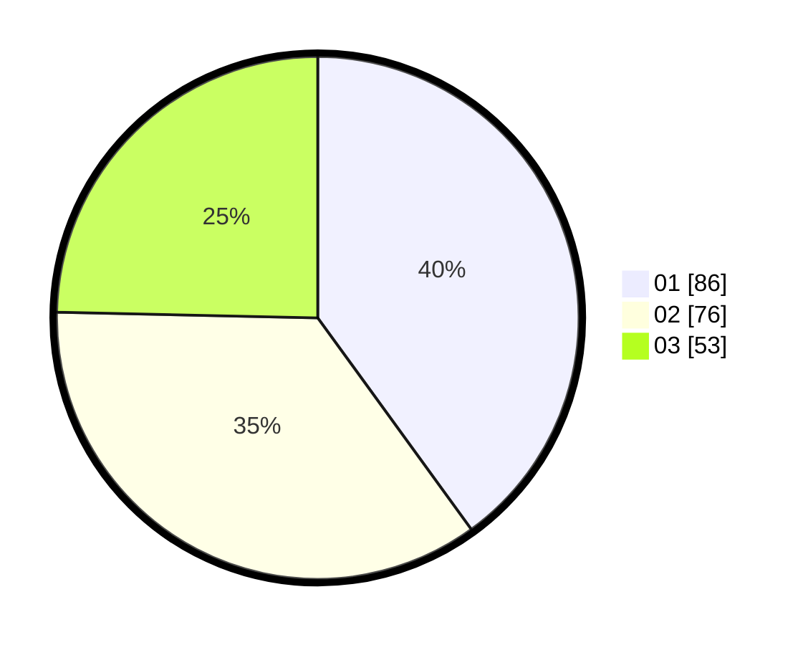

# Hasil

Hasil perolehan suara paslon dapat dilihat pada file paslon-01.txt, paslon-02.txt, dan paslon-03.txt.

Jika tidak ada, artinya data tersebut belum ada pada SIREKAP.

## Perolehan Suara

 * Paslon 01: **86**.
 * Paslon 02: **76**.
 * Paslon 03: **53**.

## Foto C Plano

https://sirekap-obj-formc.kpu.go.id/146d/pemilu/ppwp/31/75/02/10/01/3175021001070-20240216-145509--ad82610c-de3e-4e07-8805-3c636ec5532f.jpg

https://sirekap-obj-formc.kpu.go.id/146d/pemilu/ppwp/31/75/02/10/01/3175021001070-20240215-004447--f3cfc5d9-0e90-4ad2-b454-98fd43a56f3d.jpg

https://sirekap-obj-formc.kpu.go.id/146d/pemilu/ppwp/31/75/02/10/01/3175021001070-20240216-145510--e8c034f1-4058-49e5-b434-54d4acc151a8.jpg

## DATA PEMILIH TETAP

Jumlah pemilih dalam DPT: **273**.
 * L: **131**.
 * P: **142**.

## DATA PENGGUNA HAK PILIH

Jumlah pengguna hak pilih dalam DPT: **219**.
 * L: **103**.
 * P: **116**.

Jumlah pengguna hak pilih dalam DPTb: **4**.
 * L: **1**.
 * P: **3**.

Jumlah pengguna hak pilih dalam DPK: **0**.
 * L: **0**.
 * P: **0**.

Jumlah pengguna hak pilih: **223**.
 * L: **104**.
 * P: **119**.

## JUMLAH SUARA SAH DAN TIDAK SAH

JUMLAH SELURUH SUARA SAH: **215**.

JUMLAH SUARA TIDAK SAH: **8**.

JUMLAH SELURUH SUARA SAH DAN SUARA TIDAK SAH: **223**.
