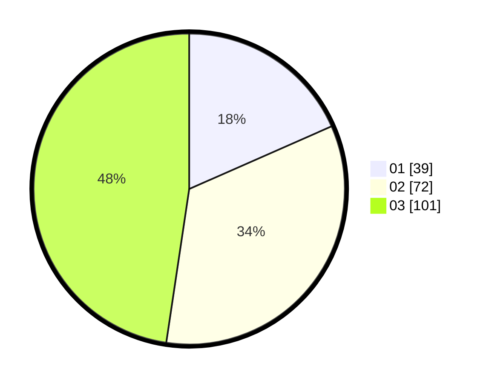

# Hasil

Hasil perolehan suara paslon dapat dilihat pada file paslon-01.txt, paslon-02.txt, dan paslon-03.txt.

Jika tidak ada, artinya data tersebut belum ada pada SIREKAP.

## Perolehan Suara

 * Paslon 01: **39**.
 * Paslon 02: **72**.
 * Paslon 03: **101**.

## Foto C Plano

https://sirekap-obj-formc.kpu.go.id/8b2b/pemilu/ppwp/31/75/02/10/01/3175021001071-20240216-033837--406a4c2f-d89a-4e6a-970d-ab2cc3b55104.jpg

https://sirekap-obj-formc.kpu.go.id/8b2b/pemilu/ppwp/31/75/02/10/01/3175021001071-20240216-033838--e3e3c1c0-f35e-44ff-a36f-3e88c2ee4674.jpg

https://sirekap-obj-formc.kpu.go.id/8b2b/pemilu/ppwp/31/75/02/10/01/3175021001071-20240216-033837--aaa5e92f-f982-4cc8-8bac-fb0d0d3a87d5.jpg

## DATA PEMILIH TETAP

Jumlah pemilih dalam DPT: **275**.
 * L: **131**.
 * P: **144**.

## DATA PENGGUNA HAK PILIH

Jumlah pengguna hak pilih dalam DPT: **209**.
 * L: **94**.
 * P: **115**.

Jumlah pengguna hak pilih dalam DPTb: **8**.
 * L: **0**.
 * P: **8**.

Jumlah pengguna hak pilih dalam DPK: **0**.
 * L: **0**.
 * P: **0**.

Jumlah pengguna hak pilih: **217**.
 * L: **94**.
 * P: **123**.

## JUMLAH SUARA SAH DAN TIDAK SAH

JUMLAH SELURUH SUARA SAH: **212**.

JUMLAH SUARA TIDAK SAH: **5**.

JUMLAH SELURUH SUARA SAH DAN SUARA TIDAK SAH: **217**.
