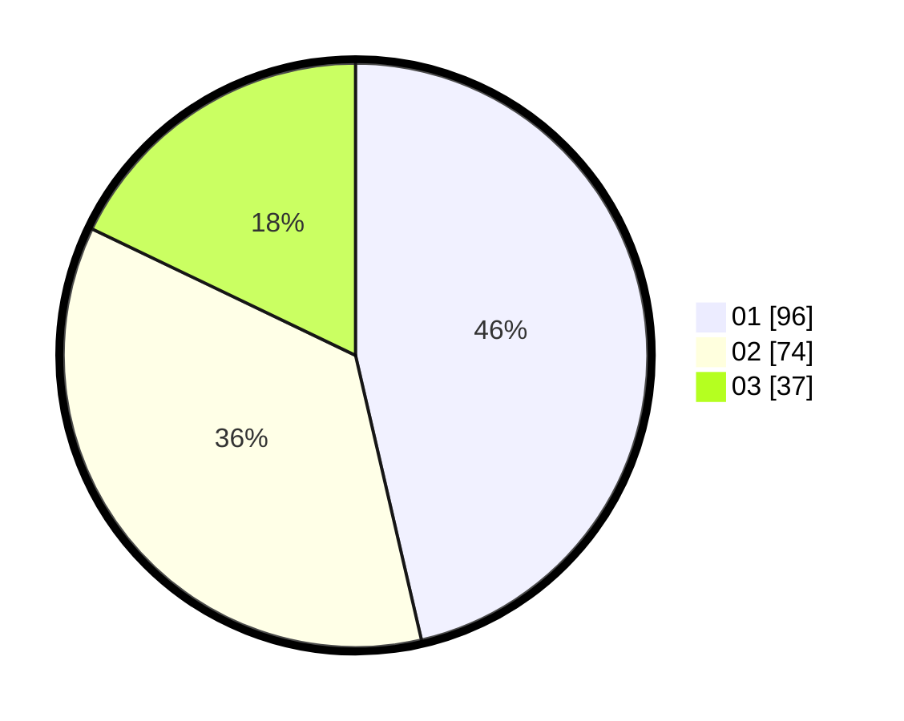

# Hasil

Hasil perolehan suara paslon dapat dilihat pada file paslon-01.txt, paslon-02.txt, dan paslon-03.txt.

Jika tidak ada, artinya data tersebut belum ada pada SIREKAP.

## Perolehan Suara

 * Paslon 01: **96**.
 * Paslon 02: **74**.
 * Paslon 03: **37**.

## Foto C Plano

https://sirekap-obj-formc.kpu.go.id/d6d5/pemilu/ppwp/31/75/02/10/01/3175021001075-20240216-000616--aa9fc46a-a5ad-4df5-9cab-1e6a3cf3103c.jpg

https://sirekap-obj-formc.kpu.go.id/d6d5/pemilu/ppwp/31/75/02/10/01/3175021001075-20240216-000617--10a99c99-2b43-4e1d-8410-c960681d3af0.jpg

https://sirekap-obj-formc.kpu.go.id/d6d5/pemilu/ppwp/31/75/02/10/01/3175021001075-20240216-000617--62971bbe-dc57-4b78-98ff-5aa8decadbe9.jpg

## DATA PEMILIH TETAP

Jumlah pemilih dalam DPT: **0**.
 * L: **0**.
 * P: **0**.

## DATA PENGGUNA HAK PILIH

Jumlah pengguna hak pilih dalam DPT: **0**.
 * L: **0**.
 * P: **0**.

Jumlah pengguna hak pilih dalam DPTb: **0**.
 * L: **0**.
 * P: **0**.

Jumlah pengguna hak pilih dalam DPK: **0**.
 * L: **0**.
 * P: **0**.

Jumlah pengguna hak pilih: **0**.
 * L: **0**.
 * P: **0**.

## JUMLAH SUARA SAH DAN TIDAK SAH

JUMLAH SELURUH SUARA SAH: **207**.

JUMLAH SUARA TIDAK SAH: **4**.

JUMLAH SELURUH SUARA SAH DAN SUARA TIDAK SAH: **211**.
